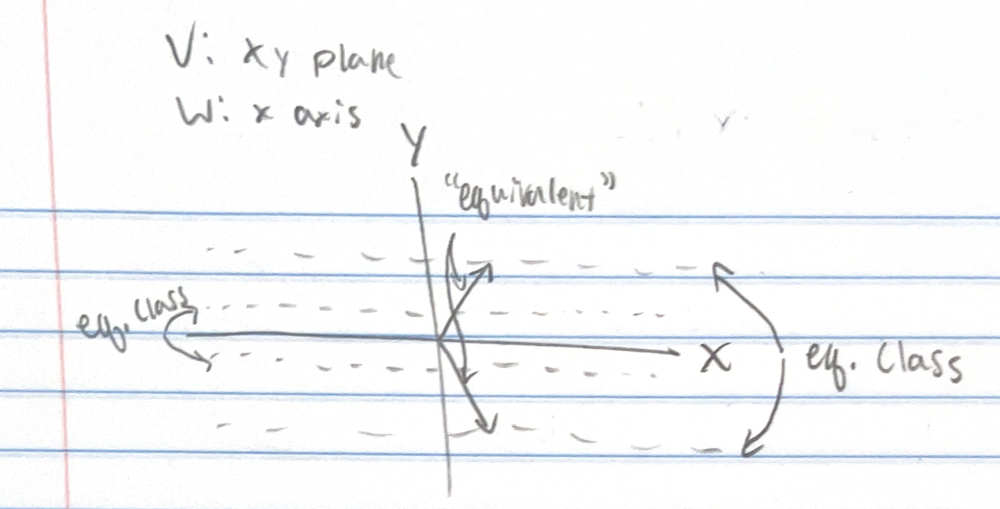
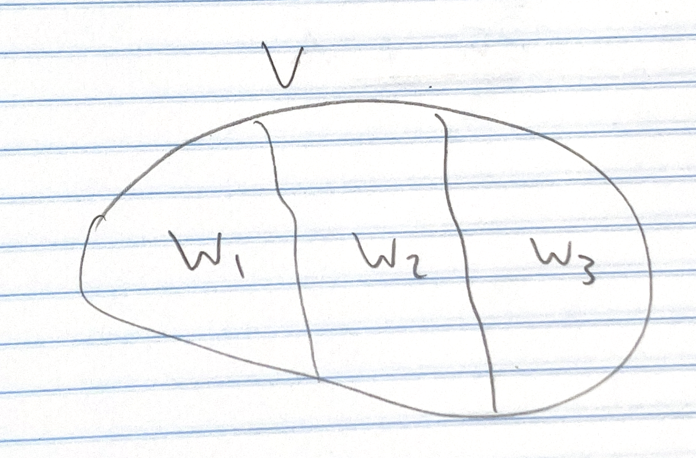
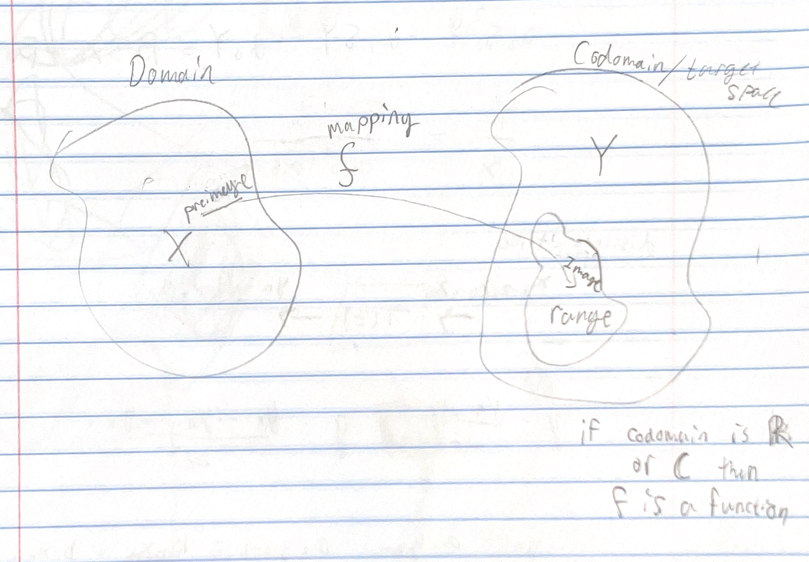

# Mathematical Physics Assignments

## 4

Take any two open intervals $(a, b)$ and $(c, d)$, and show that there are as many points in the first as there are in the second, **regardless of the length of the intervals**. Hint: Find a (linear) relation between the points of the two intervals

$(a, b)$

$(c, d)$

Define a linear map $f(x) : (a,b) \to (c,d)$

Since its linear and one dimensional, the map $f(x) = \alpha x + \beta$ is bijective as long as $\alpha \ne 0$, meaning there is a one-to-one correspondence between the sets $(a,b)$ and $(c,d)$.  

So if there can exist a linear mapping from $(a,b) \to (c,d)$, then there are exactly the same amount of points in these two sets.

The linear map defined by $f(x) = \alpha x + \beta$ must satisfy $f(a) = c$ and $f(b) = d$

The resulting system of equations becomes

$c = \alpha a + \beta$

$d = \alpha b + \beta$

Solving the system gives

$\alpha = \frac{d - c}{b-a}$

$\beta = c - \frac{a(d-c)}{b - a}$

This is a very interesting property of $\mathbb{R}$.  Since a linear, bijective map can be defined that maps one interval of the set to another interval, this means the cardinality of both intervals is the same

## 5

What is a vector space? Give as precise a definition as you can.

A vector space is a set of objects (called vectors) that themselves have dimensionality.  To define a vector space, one must precisely define the operations of addition and multiplication inthat space, and also must define the zero vector.

Give an example.

An example of a vector space is $\mathbb{R}^3$ which is Euclidean space.  It is the set of all vectors that can be defined by three real numbers.

What makes a vector space so useful for doing physics?

Vector spaces are very useful for characterizing physical dimensions or phenomenon, and performing analysis using the defined vector operations.  For example, $\mathbb{R}^3$ is used to describe the three dimeniosal space that humans can perceive, and $\mathbb{R}^4$ is used to include the fourth dimension of time in that space.  These vector spaces are essential for describing how the natural world works in Newtonian and relativistic mechanics respectively.  We use them to describe physical things like distance, velocity, and force, and we derive physical laws about how these relate to one another in the context of the defined vector space.

## 6

This problem aims to help you understand factor spaces (a.k.a., quotient spaces). It should be attempted after completing the first reading for Chapter 2.

Consider $V = \mathbb{R}^2$, a vector space over the reals. Define a relation on $V = \mathbb{R}^2$ so that $a \bowtie b$ if the difference of the two vectors, $a - b$, is contained in $W = R$. (Notice that $W$ is a subspace of $V$ and that $a, b \in V$). (Drawing a picture of V, W, and two "equivalent" vectors, is be helpful.) 

* What is the factor set V/W (The factor set is also known as the quotient set.) 

The factor set would be all equivalence classes $[[a]] = \{b \in \mathbb{R}^2 \; | \; a - b \in \mathbb{R} \}$ this means that the factor set constains all pairs of vectors whose differences are contained in $\mathbb{R}$. Does this mean that it is all vectors whose difference lies on the x-axis?  That would be true if $W$ was the x-axis, essentially meaning two vectors are equivalent if they are reflections of each other about the x-axis (their y components cancel).

* Draw a picture of V, W, and the quotient set, V/W 

Assuming my reasoning for part 1 is on the right track...

* Explain how the factor set can be made into a factor space

Still hazy on this, but essentially we define the operation 

$$\alpha [[a]] + \beta [[b]] = [[\alpha a + \beta b]]$$

We need this because in order to be a vector space we have to define addition and scalar multiplication.

We need to enforce that the equation is true no matter what representative of each equivalent class we choose.  So we pick two equivalent vectors $a = a'$ and $b = b'$ and we enforce

$$(\alpha a + \beta b) - (\alpha a' + \beta b') \in Wi$$

* Re-read the first paragraph of Sec. 2.1.2 (page 24)

I've been over it a few times

## 7

## 8

Let $\mathbb{R}^+$ denote the set of positive real numbers. Define the "sum" of two elements of $\mathbb{R}^+$ to be their usual product, and define scalar multiplication by elements of $\mathbb{R}$ as being given by $r \cdot p = p^r$ where $r \in \mathbb{R}$ and $p \in \mathbb{R}^+$.  Wtih these operations, show that $\mathbb{R}^+$ is a vector space over $\mathbb{R}$

To show that $\mathbb{R}^+$ is a vector space over $\mathbb{R}$, must show that it is a set of objects where the following is defined

* Vector addition is defined
    * $a + b = b + a$
    * $a + (b + c) = (a + b) + c$
    * zero vector is defined as 0 where $a + 0 = a$
    * $a + -a = 0$
* Scalar multiplication is defined
    * $\alpha (\beta a) = (\alpha \beta) a$
    * $1 a = a$ 
* Scalar multiplication is distributive
    * $\alpha (a + b) = \alpha a + \alpha b$
    * $(\alpha + \beta) a = \alpha a + \beta a$

For vector addition defined as $p_1 + p_2 = \rho_1 \rho_2$ where $\rho_1$ and $\rho_2$ are the scalar elements of the 1 dimensional vectors $p_1,p_2 \in \mathbb{R}^+$

$$p_1 + p_2 = \rho_1 \rho_2 = \rho_2 \rho_1= p_2 + p_1$$

$$p_1 + (p_2 + p_3) = \rho_1(\rho_2 \rho_3) = (\rho_1\rho_2) \rho_3 = (p_1 + p_2) + p_3$$

$$p + 0 = \rho0 = 0$$

$$p + -p = \rho0 = 0$$

where $-p$ is defined as $0 \; \forall p \in \mathbb{R}^+$.  All of the requirements for vector addition are satisfied.

For scalar multiplication defined as $r \cdot p = \rho^r$ where $r \in \mathbb{R}$ and $p \in \mathbb{R}^+$,

$$r_1 \cdot (r_2 \cdot p) = (p^{r_2})^{r_1} = p^{r_1r_2} = r_1r_2 \cdot p$$

$$1 \cdot p = p^1 = p$$

$$r \cdot (p_1 + p_2) = (\rho_1 \rho_2)^{r} = \rho_1^{r}\rho_2^{r} = r \cdot p_1 + r \cdot p_2$$

$$(r_1 + r_2) \cdot p = \rho ^{r_1 + r_2} = \rho^{r_1}\rho^{r_2} = r_1 \cdot \rho + r_2 \cdot \rho$$

All of the requirements for scalar multiplication are satisfied.  Therefore with these defined operations $\mathbb{R}^+$ is a vector space over $\mathbb{R}$.

It is suprising that defining addition and multiplication operations in this way is possible and it still is a valid vector space that we can do anlysis in just like any other more conventional vector space.  It shows the power of abstraction which allows us to perform analysis in seemingly very different spaces that follow the same rules.

The phrase "With these operations" is important to the problem statement because the choise of operation for addition and scalar multiplication is crucial for defining a vector space.  In this case we were able to prove it is a vector space because the scalar products and exponentiation turned out to have the same communitive and distributive properties as the normal definitions of addition and multiplication.  We couldn't just chose any definition and hope it works out.

## 10

Given the linearly independent vectors $x(t) = t^n$, for $n = 0,1,2,...$ in $P^c[t]$, use the Gram-Schmidt process to find the orthonormal polynomials $e_0(t), e_1(t)$, and $e_2(t)$ when the inner
product is defined with a nontrivial weight function:

$$\langle x, y \rangle = \int_{-\infty}^{\infty} e^{-t^2} x(t) y(t) dt$$

Hint: Use the following result:

$$\int_{-\infty}^{\infty} e^{-t^2}t^n dt = \begin{cases}
\sqrt{\pi} & \text{ if } n = 0 \\
0 & \text{ if } n \text{ is odd} \\
\sqrt{\pi} \frac{1 \cdot 3 \cdot 5 \cdots (n-1)}{2^{n/2}}  & \text{ if } n \text{ is even} 

\end{cases}$$

For $e_0$

$$e_0 = \frac{x_0}{\sqrt{\langle x_0, x_0 \rangle}} = \frac{t^0}{\sqrt{\int_{-\infty}^{\infty} e^{-t^2} t^0 t^0 dt}} = \boxed{\frac{1}{\pi^{1/4}}}$$

For $e_1$

$$e_1' = x_1 - e_0 \langle e_0, x_1\rangle = t^1 - \frac{1}{\pi^{1/4}} \int_{-\infty}^{\infty} e^{-t^2} \frac{1}{\pi^{1/4}}  t^1 dt = t$$
$$e_1 = \frac{e_1'}{\sqrt{\langle e_1', e_1' \rangle}} = \frac{t}{\sqrt{\int_{-\infty}^{\infty} e^{-t^2} t^2 dt}} = \boxed{\frac{2t}{\sqrt{2}\pi^{1/4}}}$$

For $e_2$

$$e_2' = x_2 - e_1 \langle e_1, x_2\rangle - e_0 \langle e_0, x_2\rangle $$
$$ = t^2 - \frac{2t}{\sqrt{2}\pi^{1/4}} \int_{-\infty}^{\infty} e^{-t^2} \frac{2t}{\sqrt{2}\pi^{1/4}} t^2 dt - \frac{1}{\pi^{1/4}} \int_{-\infty}^{\infty} e^{-t^2} \frac{1}{\pi^{1/4}}  t^2 dt = t^2 - \frac{1}{2}$$

$$e_2 = \frac{e_2'}{\sqrt{\langle e_2', e_2' \rangle}} = \frac{t^2 - \frac{1}{2}}{\sqrt{\int_{-\infty}^{\infty} e^{-t^2} (t^4 - t^2 + \frac{1}{4}) dt}} = \boxed{\frac{2t^2 - 1}{\pi^{1/4}\sqrt{5}}}$$

## 11

Show that the following vectors form a basis for $\mathbb{C}^n$ (or $\mathbb{R}^n$).

$$a_1 = \begin{pmatrix}
1 \\
1 \\
\vdots \\
1 \\
1 \\
\end{pmatrix}, \ \ 

a_2 = \begin{pmatrix}
1 \\
1 \\
\vdots \\
1 \\
0 \\
\end{pmatrix}, \ \ \cdots, \ \

a_n = \begin{pmatrix}
1 \\
0 \\
\vdots \\
0 \\
0 \\
\end{pmatrix} 
$$

For an arbitrary vector $v = (v_1, v_2, \cdots, v_n) \in \mathbb{R}^n$, in order for the above vectors to span $\mathbb{R}^n$, we need to be able to construct $v$ from a linear combination of the basis vectors.

This means that

$$v = c1 a_1 + c2 a_2 + \cdots + c_n a_n$$

This corresponds to the following system of equations

$$v_1 = c_1 + c_2 + \cdots + c_n$$
$$v_2 = c_1 + c_2 + \cdots + c_{n-1}$$
$$\vdots$$
$$v_{n-1} = c_1 + c_2$$
$$v_n = c_1$$

We can solve this system of equations for the coefficients $(c_1, c_2 \cdots c_n)$.  

$$c_1 = v_n$$
$$c_2 = v_{n-1} - v_n$$
$$c_3 = v_{n-2} - v_n - (v_{n-1} - v_n) = v_{n-2} - v_{n-1}$$
$$\vdots$$

This means that the vectors $\{v_1, v_2 \cdots v_n\}$ span $\mathbb{R}^n$ because we can construct any arbitrary vector in $\mathbb{R}^n$ by a linear combination of them.

They are also linearly independant of one another 

$$det\begin{pmatrix}
1 & 1 & \cdots & 1 & 1 \\
1 & 1 & \cdots & 1 & 0 \\
& & \vdots & & \\
1 & 0 & \cdots & 0 & 0
\end{pmatrix} \ne 0$$

This means they form a basis for $\mathbb{R}^n$

## 12

Is there a difference between the vector space $V = \mathbb{R}^2$ and the vector space

$$U = \oplus_{i=1}^2 \mathbb{R} ?$$

Explain.

I think that there is no difference between the direct sum of the following two spaces

$$\text{span}\{(1,0)\}$$
$$\text{span}\{(0,1)\}$$

I'm not sure if doing a direct sum over $\mathbb{R}$ and another $\mathbb{R}$ will have the same result.  But essentially if you take the direct sum of the vector spaces corresponding to the x-axis and y-axis, then you have the plane $\mathbb{R}^2$ 

## 13

Sort out this jargon: domain, codomain, image, preimage, range, target space, function, mapping 

These words come up here and there, not often enough that you will remember them without trying, but often enough that your understanding will be hindered if you don't have a good conceptual grasp of them. Some are similar, with subtle differences in meaning that arenonetheless important. 

What is the definition of each of these, in your own words? (A useful retelling is better than something technically correct but abstruse

**Domain:** The vector space corresponding to the inputs of a map between two spaces

**Codomain:** The vector space corresponding to the outputs of a map (potentially larger than the range of the map)

**Image:** The map $f(x)$ would be the image of $x$ under $f$. ($f(x)$ would be the image of that specific input value whereas $f(X)$ would be the the image of $X$, the set of all outputs).  Its basically saying that the map itself is like a projection onto the output space, or "image"

**Preimage:** $f^{-1}(B) = \{ x \in X | f(x) \in B\}$.  So basically all elements in $X$ whose outputs are in some predefined $B$

**Tange:** $f(X) \subset Y$ The subset of output space which can be reached by the map.

**Target space:**  This is the output space $Y$ - same as codomain

**Function:** A special type of map whose codomain is the set of reals $\mathbb{R}$ or the set of complex numbers $\mathbb{C}$ 

**Mapping:** An operation that takes an input in one vector space and returns an ouput in another vector space:w

Is there a difference between a "target space" and a "range"

Yes, the target space is the codomain, or the vector space in which the outputs of a map lie.  The range is the space that covers all possible outputs of the map.  It is a subspace of the target space.  It could be the same as the target space but in general it is a subspace.

## 14

For the mapping $T : V \to U$ to be linear, it must satisfy $T(\alpha a + \beta b) = \alpha T(a) + \beta T(b)$

The mapping $T(x,y) = (x^2 + y^2, x + y, 2x - y)$ is not linear because

$$T(\alpha a + \beta b)_1 = (\alpha a_1 + \beta b_1)^2 + (\alpha a_2 + \beta b_2)^2$$

$$\alpha T(a)_1 + \beta T(b)_1 = \alpha(a_1 + a_2)^2 + \beta(b_1 + b_2)^2$$

The two expressions are not equal, therefore it is not linear.

## 15

The mapping $\Phi : M^{n \times n} \to \mathbb{C}$ defined by 

$$\Phi(M) = \sum_{j=1}^n = \mu_{jj}$$

where $\mu_{ij}$ represents the elements in $M$, is linear because

$$\Phi(\alpha A + \beta B) = \sum_{j=1}^n (\alpha A + \beta B)_{jj} = \alpha\sum_{j=1}^nA_{jj} +  \beta\sum_{j=1}^nB_{jj} = \alpha\Phi(A) + \beta\Phi(B)$$

Therefore it is linear map from a vector space to the set of real or complex scalars (definition of a linear functional).

This map is the sum of the diagonal elements of a matrix and is also called the trace of the matrix.

The operator $\mathbf{int} : C^0(a,b) \to \R$ defined as 

$$\mathbf{int}(f) = \int_a^b f(t)dt$$

is linear because

$$\mathbf{int}(\alpha f_1 + \beta f_2) = \int_a^b (\alpha f_1(t) + \beta f_2(t))dt = \alpha\int_a^b f_1(t)dt + \beta \int_a^b f_s(t)dt = \alpha\mathbf{int}(f_1) + \beta\mathbf{int}(f_2)$$

It also maps to a scalar, therefore it is a linear functional.

The vector space $C^0(a,b)$ is the set of all functions that are $C^0$ continuous that lie on the interval $(a,b)$.  $C^0$ continuous means that the function itself is defined everywhere on that interval, but the functions derivative need not be.

## 16

An example of a linear map with a non-trivial null space is defined by the matrix

$$\begin{pmatrix}

1 & 1 & 1 \\
3 & 2 & 5 \\
5 & 4 & 7
\end{pmatrix}$$

The row rediced echelon form of this matrix is

$$\begin{pmatrix}
1 & 0 & 3 \\
0 & 1 & -2 \\
0 & 0 & 0
\end{pmatrix}$$

The null space of this matrix is the span of $\{(0,0,1)\}$. 

The null space is a vector space because you can make linear combinations of vectors in the null space, and you still end up in the null space

$$\alpha(0,0,a) + \beta(0,0,b) = (0,0,\alpha a+\beta b)$$

This operation is also communitive and associative.  The null space includes the zero vector because $0(0,0,1) = (0,0,0)$, and there always exists the vector $-a = (0,0,-a)$ such that $-a  + a = 0$

The geometric interpretation is that any vector with only a $z$ component will be mapped to the zero vector, meaning the null space encompasses the z axis.  Any vector that is transformed by this map will essentially be flattened onto the $xy$ plane.

The matrix

$$\begin{pmatrix}
-1 & 1 & -1 \\
4 & -3 & 3 \\
7 & -5 & -5
\end{pmatrix}$$

expressed in row reduced echelon form is 

$$\begin{pmatrix}
1 & 0 & 0 \\
0 & 1 & 0 \\
0 & 0 & 1
\end{pmatrix}$$

The identity matrix.  Therefore the null space of this map is the zero vector.

This exercise helped me to consolidate the physical meaning of the null space, and how to mathematically represent it given a defined linear map.

## 17

The set of integers $S = \{0,1,2\}$ together with the operations addition and multiplication defined with modulo 3 define a field.  If we construct two-dimensional vectors in this field, then we have

$$a + b = (mod_3(a_1 + b_1), mod_3(a_2 + b_2)) = (mod_3(b_1 + a_1) = mod_3(b_2 + a_2)) = b + a$$

$$a + (b + c) = mod_3(a_i + mod_3(b_i + c_i)) = mod_3(a_i + b_i + c_i) = mod_3(mod_3(a_i + b_i) +c_i) = (a+b) + c$$

defining the zero vector as $(0,0)$ and the negative vector as $-a = (mod_3(-a_1), mod_3(-a_2))$

$$a + 0 = mod_3(a_i + 0) = mod_3(a_i) = a$$

$$a + -a = mod_3(a_i + mod_3(-a_i)) = mod_3(0) = 0$$

$$\alpha(\beta a) = mod_3(\alpha mod_3(\beta a_i)) = mod_3(\alpha\beta a_i) = mod_3(mod_3(\alpha \beta)a_i) = (\alpha \beta)a$$

$$1a = mod_3(1a_i) = a$$

$$\alpha(a + b) = mod_3(\alpha mod_3(a_i + b_i)) = mod_3(mod_3(\alpha a_i) + mod_3(\alpha b_i)) = \alpha a + \alpha b$$

$$(\alpha + \beta)a = mod_3(mod_3(\alpha + \beta)a_i) = mod_3(mod_3(\alpha a_i) + mod_3(\beta a_i)) = \alpha a + \beta a$$

A basis for this vector space is $\{ (1, 0), (0, 1)\}$

To extend this to an algebra, we can define the the element wise product $ab = (a_1b_1, a_2b_2)$.  Relying on the properties of multiplication and addition defined above,

$$a(\beta b + \gamma c) = a_i(\beta b_i + \gamma c_i) = \beta ab + \gamma ac$$

$$(\beta b + \gamma c)a = (\beta b_i + \gamma_i c)a_i = \beta b_i a_i + \gamma c_i a_i$$

## 18

For the vector space $V = \R^2$, if the vector-vector product is defined as 

$$(x_1, x_2)(y_1, y_2) = (x_1y_1 - x_2y_2, x_1y_2 + x_2y_1)$$

We have

$$x(a y + b z) = (x_1(ay_1 + bz_1) - x_2(ay_2 + bz_2), x_1(ay_2 + bz_2) + x_2(ay_1 + bz_1)) = (a(x_1y_1 - x_2y_2) + b(x_1z_1 - x_2z_2), a(x_1y_2 + x_2y_1) + b(x_1z_2 + x_2z_1)) = axy + bxz$$

$$(ay + bz)x = ((ay_1 + bz_1)x_1 - (ay_2 + bz_2)x_2, (ay_1 + bz_1)x_2 + (ay_2 + bz_2)x_1) = (a(y_1x_1 - y_2x_2) + b(z_1x_1 - z_2x_2), a(y_1x_2 + y_2x_1) + b(z_1x_2 + z_2x_1)) = ayx + bzx$$

Therefore this is a valid algebra

This algebra is associative because

$$x(yz) = (x_1(y_1z_1 - y_2z_2) - x_2(y_1z_2 + y_2z_1), x_1(y_1z_2 + y_2z_1) + x_2(y_1z_1 - y_2z_2)) = ((x_1y_1 - x_2y_2)z_1 - (x_1y_2 + x_2y_1)z_2, (x_1y_1 - x_2y_2)z_2 + (x_1y_2 + x_2y_1)z_1) = (xy)z$$

And it is communitive because

$$xy =  (x_1y_1 - x_2y_2, x_1y_2 + x_2y_1) = (y_1x_2 - y_2x_2, y_1x_2 + y_2x_1) = yx$$

The cross product on $\R^3$ is defined as

$$xy = (x_2y_3 - x_3y_2, x_3y_1 - x_1y_3, x_1y_2 - x_2y_1)$$

This is an algebra because

$$x(ay + bz) = (x_2(ay_3 + bz_3) - x_3(ay_2 + bz_2), x_3(ay_1 + bz_1) - x_1(ay_3 + bz_3), x_1(ay_2 + bz_2) - x_2(ay_1 + bz_1)) = (a(x_2y_3 - x_3y_2) + b(x_2z_3 - x_3z_2), a(x_3y_1 - x_1y_3) + b(x_3z_1 - x_1z_3), a(x_1y_2 - x_2y_1) + b(x_1z_2 - x_2z_1)) = axy + bxz$$

$$(ay + bz)x = ((ay_2 + bz_2)x_3 - (ay_3 + bz_3)x_2, (ay_3 + bz_3)x_1 - (ay_1 + bz_1)x_3, (ay_1 + bz_1)x_2 - (ay_2 + bz_2)x_1) = (a(y_2x_3 - y_3x_2) + b(z_2x_3 - z_3x_2), a(y_3x_1 - y_1x_3) + b(z_3x_1 - z_1x_3), a(y_1x_2 - y_2x_1) + b(z_1x_2 - z_2x_1)) = ayx + bzx$$

The algebra is not associative because

$$x(yz) = (x_2(y_1z_2 - y_2z_1) - x_3(y_3z_1 - y_1z_3), x_3(y_2z_3 - y_3z_2) - x_1(y_3z_1 - y_1z_3), x_1(y_3z_1 - y_1z_3) - x_2(y_2z_3 - y_3z_2)) \ne (xy)z$$

It is not communitive because

$$xy = (x_2y_3 - x_3y_2, x_3y_1 - x_1y_3, x_1y_2 - x_2y_1) \ne yx$$

## 19

The map $A_{\pi}$ where $\pi$ of the integers is linear.  If $x = (x_0, x_1, \cdots , x_n) \in \mathbb{C}^n$

then 

$$A_{\pi} x = (x_{\pi(1)}, x_{\pi(2)}, \cdots, x_{\pi(n)})$$

$$A_{\pi}(ax + by) = (ax_{\pi(1)} + by_{\pi(1)}, ax_{\pi(2)} + by_{\pi(2)}, \cdots, ax_{\pi(n)} + by_{\pi(n)}) = aA_{\pi}x + bA_{\pi}y$$

This satisfies the requirements of a linear map.

If $x \in \mathbb{P}^c[t]$ is defined as $x(t) = \sum_{k=0}^n a_k t^k$, and we define the operator $D$ such that $y = Dx$ where $y(t) = \sum_{k=1}^n ka_kt^{k-1}$, then $D$ is the linear derivative operator.

We can write this as a matrix vector equation

$$\begin{pmatrix}
t^0 \\
2t^1 \\
3t^2 \\
\vdots \\
nt^{n-1}
\end{pmatrix} = 

\begin{pmatrix}
1 & 0 & 0 & 0 & \cdots & 0 & 0 \\
0 & 2 & 0 & 0 & \cdots & 0 & 0 \\
0 & 0 & 3 & 0 & \cdots & 0 & 0 \\
  &   &   & \vdots &   &   &   \\
0 & 0 & 0 & 0 & \cdots & 1 & 0 \\
\end{pmatrix}

\begin{pmatrix}
t^0 \\
t^1 \\
t^2 \\
\vdots \\
t^n
\end{pmatrix}$$

This mapping can be written down as a matrix operation, which means it is linear because any matrix operation follows

$$D(ax + by) = aDx + bDy$$

$C^n(a,b) is the set of all functions in the interval $(a,b)$ whose first $n$ derivatives are continuous.  for all $f \in C^n(a,b)$ define $u = Gf$ where $u(t) = g(t)f(t)$ and $g(t)$ is a fixed function in $C^n(a,b)$.  

$G$ is linear because

$$G(af_1 + bf_2) = g(t)(af_1(t) + bf_2(t)) = ag(t)f_1(t) + bg(t)f_2(t) = aGf_1 + bGf_2$$

This holds also for the cases where $g(t) = t$

$$t(af_1 + bf_2) = atf_1(t) = btf_2(t)$$

## 20

For the algebra of $\R^2$ with multiplication defined as element wise scalar multiplication.

The unit element of this algebra is $(1,1)$

A subalgebra is defined for the subspace $\R$ with multiplication defined as normal scalar multiplication.

The center is all elements in $\R^2$ which commute with all other elements of $\R^2$.  For this example the center is all of $\R^2$

## 21

For the algebra where the vector sace is $R^3$ and multipliation is the cross product defined by

$$xy = (x_2y_3 - x_3y_2, x_3y_1 - x_1y_3, x_1y_2 - x_2y_1)$$

The basis for this vector space is $\{e_x, e_y, e_z\} = \{(1,0,0), (0,1,1), (0,0,1)\}$

The structure constants are defined by

$$e_ie_j = c_{ij}^1 e_x + c_{ij}^2 e_y + c_{ij}^3 e_z$$

$$c_{i,j}^1 = \begin{pmatrix}
0 & 0 & 0 \\
0 & 0 & 1 \\
0 & -1 & 0 
\end{pmatrix}$$

$$c_{i,j}^2 = \begin{pmatrix}
0 & 0 & -1 \\
0 & 0 & 0 \\
1 & 0 & 0 
\end{pmatrix}$$

$$c_{i,j}^1 = \begin{pmatrix}
0 & 1 & 0 \\
-1 & 0 & 0 \\
0 & 0 & 0 
\end{pmatrix}$$

The algebra is not associative because

$$x(yz) = (x_2(y_1z_2 - y_2z_1) - x_3(y_3z_1 - y_1z_3), x_3(y_2z_3 - y_3z_2) - x_1(y_3z_1 - y_1z_3), x_1(y_3z_1 - y_1z_3) - x_2(y_2z_3 - y_3z_2)) \ne (xy)z$$

It is not communitive because

$$xy = (x_2y_3 - x_3y_2, x_3y_1 - x_1y_3, x_1y_2 - x_2y_1) \ne yx$$

The center of the algebra is $0$, because it is the only one that commutes with everything else.

The algebra does not have an identity.  There is no vector that multiplies with any other vector and returns that same vector

## 22

For all points in the plane except zero, $\R^2 ~ \{0\}$, define an equivalence relation $\bowtie$ where two points are equal if they lie on the same line passing through the origin.

The factor set is turned into a factor space by defining a way to construct linear combinations of elements in the set which result in another element in the set.  If we define an element in the factor set based on the angle of the line from the horizontal, the factor set turns into a factor space because you can add angles and multiply them by scalars and you get angles out.

The factor space is isomorphic to $\R$ on the interval $[0 \pi]$.  The interval is required because the line defined by $\pi + \alpha$ is the same as the line defined by $\alpha$.  This space is essentially the same as the space of one-dimensional real numbers

We need to define addition and multiplication as 

$$a + b = mod_{\pi}(a + b)$$

$$\alpha a = mod_{\pi}(\alpha a)$$

This ensures that the angles stay within the interval

Equation 2.2 holds for this case

$$dim(\R^2 ~ \{0\} / \R) = dim(\R^2 ~ \{0\}) - dim(\R) = 2 - 1 = 1$$

We cannot include the origin in the underlying set because the point at the origin lies aon all of the lines assing through the origin.  This would mean that it is equivalent to all vectors in the factor set, which would mean that every element in the factor set would be equivalent to zero.

## 23

$\pi$ is the permutation that takes (1,2,3) to (3,1,2)

for the standard basis in $\R^3$ defined by $\{e_i\}_{i=1}^3 = \{(1,0,0), (0,1,0), (0,0,1)\}$

$$A_{\pi}e_1 = (0, 1, 0)$$

$$A_{\pi}e_2 = (0, 0, 1)$$

$$A_{\pi}e_3 = (1, 0, 0)$$

