# Mathematical Physics Assignments

## 4

Take any two open intervals $(a, b)$ and $(c, d)$, and show that there are as many points in the first as there are in the second, **regardless of the length of the intervals**. Hint: Find a (linear) relation between the points of the two intervals

$(a, b)$

$(c, d)$

Define a linear map $f(x) : (a,b) \to (c,d)$

Since its linear and one dimensional, the map $f(x) = \alpha x + \beta$ is bijective as long as $\alpha \ne 0$, meaning there is a one-to-one correspondence between the sets $(a,b)$ and $(c,d)$.  

So if there can exist a linear mapping from $(a,b) \to (c,d)$, then there are exactly the same amount of points in these two sets.

The linear map defined by $f(x) = \alpha x + \beta$ must satisfy $f(a) = c$ and $f(b) = d$

The resulting system of equations becomes

$c = \alpha a + \beta$

$d = \alpha b + \beta$

Solving the system gives

$\alpha = \frac{d - c}{b-a}$

$\beta = c - \frac{a(d-c)}{b - a}$

This is a very interesting property of $\mathbb{R}$.  Since a linear, bijective map can be defined that maps one interval of the set to another interval, this means the cardinality of both intervals is the same

## 5

What is a vector space? Give as precise a definition as you can.

A vector space is a set of objects (called vectors) that themselves have dimensionality.  To define a vector space, one must precisely define the operations of addition and multiplication inthat space, and also must define the zero vector.

Give an example.

An example of a vector space is $\mathbb{R}^3$ which is Euclidean space.  It is the set of all vectors that can be defined by three real numbers.

What makes a vector space so useful for doing physics?

Vector spaces are very useful for characterizing physical dimensions or phenomenon, and performing analysis using the defined vector operations.  For example, $\mathbb{R}^3$ is used to describe the three dimeniosal space that humans can perceive, and $\mathbb{R}^4$ is used to include the fourth dimension of time in that space.  These vector spaces are essential for describing how the natural world works in Newtonian and relativistic mechanics respectively.  We use them to describe physical things like distance, velocity, and force, and we derive physical laws about how these relate to one another in the context of the defined vector space.

## 6

This problem aims to help you understand factor spaces (a.k.a., quotient spaces). It should be attempted after completing the first reading for Chapter 2.

Consider $V = \mathbb{R}^2$, a vector space over the reals. Define a relation on $V = \mathbb{R}^2$ so that $a \bowtie b$ if the difference of the two vectors, $a - b$, is contained in $W = R$. (Notice that $W$ is a subspace of $V$ and that $a, b \in V$). (Drawing a picture of V, W, and two "equivalent" vectors, is be helpful.) 

* What is the factor set V/W (The factor set is also known as the quotient set.) 

The factor set would be all equivalence classes $[[a]] = \{b \in \mathbb{R}^2 \; | \; a - b \in \mathbb{R} \}$ this means that the factor set constains all pairs of vectors whose differences are contained in $\mathbb{R}$. Does this mean that it is all vectors whose difference lies on the x-axis?  That would be true if $W$ was the x-axis, essentially meaning two vectors are equivalent if they are reflections of each other about the x-axis (their y components cancel).

* Draw a picture of V, W, and the quotient set, V/W 

Assuming my reasoning for part 1 is on the right track...

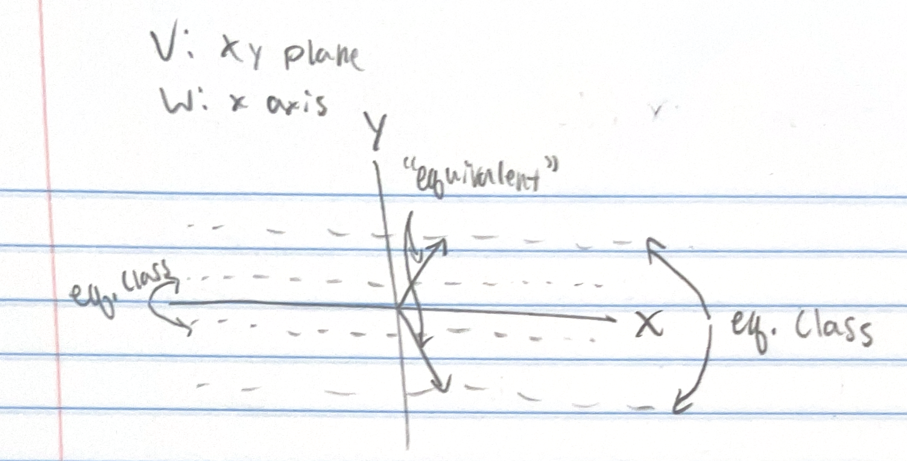

* Explain how the factor set can be made into a factor space

Still hazy on this, but essentially we define the operation 

$$\alpha [[a]] + \beta [[b]] = [[\alpha a + \beta b]]$$

We need this because in order to be a vector space we have to define addition and scalar multiplication.

We need to enforce that the equation is true no matter what representative of each equivalent class we choose.  So we pick two equivalent vectors $a = a'$ and $b = b'$ and we enforce

$$(\alpha a + \beta b) - (\alpha a' + \beta b') \in Wi$$

* Re-read the first paragraph of Sec. 2.1.2 (page 24)

I've been over it a few times

## 7

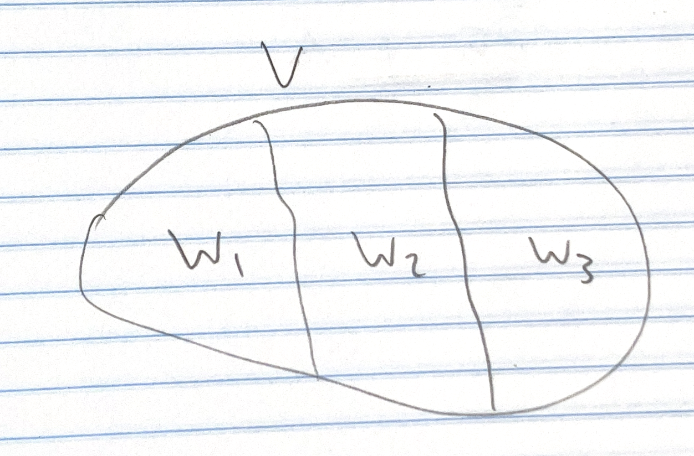

## 8

Let $\mathbb{R}^+$ denote the set of positive real numbers. Define the "sum" of two elements of $\mathbb{R}^+$ to be their usual product, and define scalar multiplication by elements of $\mathbb{R}$ as being given by $r \cdot p = p^r$ where $r \in \mathbb{R}$ and $p \in \mathbb{R}^+$.  Wtih these operations, show that $\mathbb{R}^+$ is a vector space over $\mathbb{R}$

To show that $\mathbb{R}^+$ is a vector space over $\mathbb{R}$, must show that it is a set of objects where the following is defined

* Vector addition is defined
    * $a + b = b + a$
    * $a + (b + c) = (a + b) + c$
    * zero vector is defined as 0 where $a + 0 = a$
    * $a + -a = 0$
* Scalar multiplication is defined
    * $\alpha (\beta a) = (\alpha \beta) a$
    * $1 a = a$ 
* Scalar multiplication is distributive
    * $\alpha (a + b) = \alpha a + \alpha b$
    * $(\alpha + \beta) a = \alpha a + \beta a$

For vector addition defined as $p_1 + p_2 = \rho_1 \rho_2$ where $\rho_1$ and $\rho_2$ are the scalar elements of the 1 dimensional vectors $p_1,p_2 \in \mathbb{R}^+$

$$p_1 + p_2 = \rho_1 \rho_2 = \rho_2 \rho_1= p_2 + p_1$$

$$p_1 + (p_2 + p_3) = \rho_1(\rho_2 \rho_3) = (\rho_1\rho_2) \rho_3 = (p_1 + p_2) + p_3$$

$$p + 0 = \rho0 = 0$$

$$p + -p = \rho0 = 0$$

where $-p$ is defined as $0 \; \forall p \in \mathbb{R}^+$.  All of the requirements for vector addition are satisfied.

For scalar multiplication defined as $r \cdot p = \rho^r$ where $r \in \mathbb{R}$ and $p \in \mathbb{R}^+$,

$$r_1 \cdot (r_2 \cdot p) = (p^{r_2})^{r_1} = p^{r_1r_2} = r_1r_2 \cdot p$$

$$1 \cdot p = p^1 = p$$

$$r \cdot (p_1 + p_2) = (\rho_1 \rho_2)^{r} = \rho_1^{r}\rho_2^{r} = r \cdot p_1 + r \cdot p_2$$

$$(r_1 + r_2) \cdot p = \rho ^{r_1 + r_2} = \rho^{r_1}\rho^{r_2} = r_1 \cdot \rho + r_2 \cdot \rho$$

All of the requirements for scalar multiplication are satisfied.  Therefore with these defined operations $\mathbb{R}^+$ is a vector space over $\mathbb{R}$.

It is suprising that defining addition and multiplication operations in this way is possible and it still is a valid vector space that we can do anlysis in just like any other more conventional vector space.  It shows the power of abstraction which allows us to perform analysis in seemingly very different spaces that follow the same rules.

The phrase "With these operations" is important to the problem statement because the choise of operation for addition and scalar multiplication is crucial for defining a vector space.  In this case we were able to prove it is a vector space because the scalar products and exponentiation turned out to have the same communitive and distributive properties as the normal definitions of addition and multiplication.  We couldn't just chose any definition and hope it works out.

## 10

Given the linearly independent vectors $x(t) = t^n$, for $n = 0,1,2,...$ in $P^c[t]$, use the Gram-Schmidt process to find the orthonormal polynomials $e_0(t), e_1(t)$, and $e_2(t)$ when the inner
product is defined with a nontrivial weight function:

$$\langle x, y \rangle = \int_{-\infty}^{\infty} e^{-t^2} x(t) y(t) dt$$

Hint: Use the following result:

$$\int_{-\infty}^{\infty} e^{-t^2}t^n dt = \begin{cases}
\sqrt{\pi} & \text{ if } n = 0 \\
0 & \text{ if } n \text{ is odd} \\
\sqrt{\pi} \frac{1 \cdot 3 \cdot 5 \cdots (n-1)}{2^{n/2}}  & \text{ if } n \text{ is even} 

\end{cases}$$

For $e_0$

$$e_0 = \frac{x_0}{\sqrt{\langle x_0, x_0 \rangle}} = \frac{t^0}{\sqrt{\int_{-\infty}^{\infty} e^{-t^2} t^0 t^0 dt}} = \boxed{\frac{1}{\pi^{1/4}}}$$

For $e_1$

$$e_1' = x_1 - e_0 \langle e_0, x_1\rangle = t^1 - \frac{1}{\pi^{1/4}} \int_{-\infty}^{\infty} e^{-t^2} \frac{1}{\pi^{1/4}}  t^1 dt = t$$
$$e_1 = \frac{e_1'}{\sqrt{\langle e_1', e_1' \rangle}} = \frac{t}{\sqrt{\int_{-\infty}^{\infty} e^{-t^2} t^2 dt}} = \boxed{\frac{2t}{\sqrt{2}\pi^{1/4}}}$$

For $e_2$

$$e_2' = x_2 - e_1 \langle e_1, x_2\rangle - e_0 \langle e_0, x_2\rangle $$
$$ = t^2 - \frac{2t}{\sqrt{2}\pi^{1/4}} \int_{-\infty}^{\infty} e^{-t^2} \frac{2t}{\sqrt{2}\pi^{1/4}} t^2 dt - \frac{1}{\pi^{1/4}} \int_{-\infty}^{\infty} e^{-t^2} \frac{1}{\pi^{1/4}}  t^2 dt = t^2 - \frac{1}{2}$$

$$e_2 = \frac{e_2'}{\sqrt{\langle e_2', e_2' \rangle}} = \frac{t^2 - \frac{1}{2}}{\sqrt{\int_{-\infty}^{\infty} e^{-t^2} (t^4 - t^2 + \frac{1}{4}) dt}} = \boxed{\frac{2t^2 - 1}{\pi^{1/4}\sqrt{5}}}$$

## 11

Show that the following vectors form a basis for $\mathbb{C}^n$ (or $\mathbb{R}^n$).

$$a_1 = \begin{pmatrix}
1 \\
1 \\
\vdots \\
1 \\
1 \\
\end{pmatrix}, \ \ 

a_2 = \begin{pmatrix}
1 \\
1 \\
\vdots \\
1 \\
0 \\
\end{pmatrix}, \ \ \cdots, \ \

a_n = \begin{pmatrix}
1 \\
0 \\
\vdots \\
0 \\
0 \\
\end{pmatrix} 
$$

For an arbitrary vector $v = (v_1, v_2, \cdots, v_n) \in \mathbb{R}^n$, in order for the above vectors to span $\mathbb{R}^n$, we need to be able to construct $v$ from a linear combination of the basis vectors.

This means that

$$v = c1 a_1 + c2 a_2 + \cdots + c_n a_n$$

This corresponds to the following system of equations

$$v_1 = c_1 + c_2 + \cdots + c_n$$
$$v_2 = c_1 + c_2 + \cdots + c_{n-1}$$
$$\vdots$$
$$v_{n-1} = c_1 + c_2$$
$$v_n = c_1$$

We can solve this system of equations for the coefficients $(c_1, c_2 \cdots c_n)$.  

$$c_1 = v_n$$
$$c_2 = v_{n-1} - v_n$$
$$c_3 = v_{n-2} - v_n - (v_{n-1} - v_n) = v_{n-2} - v_{n-1}$$
$$\vdots$$

This means that the vectors $\{v_1, v_2 \cdots v_n\}$ span $\mathbb{R}^n$ because we can construct any arbitrary vector in $\mathbb{R}^n$ by a linear combination of them.

They are also linearly independant of one another 

$$det\begin{pmatrix}
1 & 1 & \cdots & 1 & 1 \\
1 & 1 & \cdots & 1 & 0 \\
& & \vdots & & \\
1 & 0 & \cdots & 0 & 0
\end{pmatrix} \ne 0$$

This means they form a basis for $\mathbb{R}^n$

## 12

Is there a difference between the vector space $V = \mathbb{R}^2$ and the vector space

$$U = \oplus_{i=1}^2 \mathbb{R} ?$$

Explain.

I think that there is no difference between the direct sum of the following two spaces

$$\text{span}\{(1,0)\}$$
$$\text{span}\{(0,1)\}$$

I'm not sure if doing a direct sum over $\mathbb{R}$ and another $\mathbb{R}$ will have the same result.  But essentially if you take the direct sum of the vector spaces corresponding to the x-axis and y-axis, then you have the plane $\mathbb{R}^2$ 

## 13

Sort out this jargon: domain, codomain, image, preimage, range, target space, function, mapping 

These words come up here and there, not often enough that you will remember them without trying, but often enough that your understanding will be hindered if you don't have a good conceptual grasp of them. Some are similar, with subtle differences in meaning that arenonetheless important. 

What is the definition of each of these, in your own words? (A useful retelling is better than something technically correct but abstruse

**Domain:** The vector space corresponding to the inputs of a map between two spaces

**Codomain:** The vector space corresponding to the outputs of a map (potentially larger than the range of the map)

**Image:** The map $f(x)$ would be the image of $x$ under $f$. ($f(x)$ would be the image of that specific input value whereas $f(X)$ would be the the image of $X$, the set of all outputs).  Its basically saying that the map itself is like a projection onto the output space, or "image"

**Preimage:** $f^{-1}(B) = \{ x \in X | f(x) \in B\}$.  So basically all elements in $X$ whose outputs are in some predefined $B$

**Tange:** $f(X) \subset Y$ The subset of output space which can be reached by the map.

**Target space:**  This is the output space $Y$ - same as codomain

**Function:** A special type of map whose codomain is the set of reals $\mathbb{R}$ or the set of complex numbers $\mathbb{C}$ 

**Mapping:** An operation that takes an input in one vector space and returns an ouput in another vector space:w

Is there a difference between a "target space" and a "range"

Yes, the target space is the codomain, or the vector space in which the outputs of a map lie.  The range is the space that covers all possible outputs of the map.  It is a subspace of the target space.  It could be the same as the target space but in general it is a subspace.

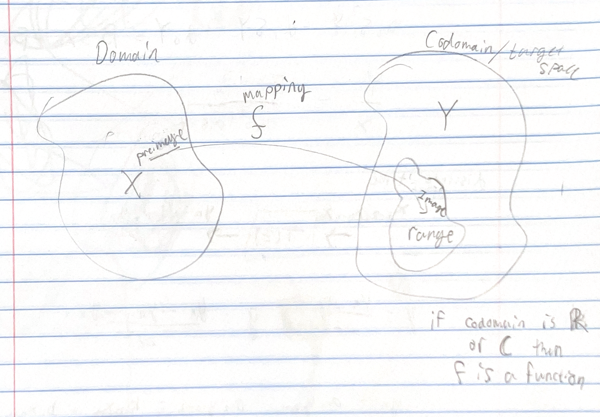

## 14

For the mapping $T : V \to U$ to be linear, it must satisfy $T(\alpha a + \beta b) = \alpha T(a) + \beta T(b)$

The mapping $T(x,y) = (x^2 + y^2, x + y, 2x - y)$ is not linear because

$$T(\alpha a + \beta b)_1 = (\alpha a_1 + \beta b_1)^2 + (\alpha a_2 + \beta b_2)^2$$

$$\alpha T(a)_1 + \beta T(b)_1 = \alpha(a_1 + a_2)^2 + \beta(b_1 + b_2)^2$$

The two expressions are not equal, therefore it is not linear.

## 15

The mapping $\Phi : M^{n \times n} \to \mathbb{C}$ defined by 

$$\Phi(M) = \sum_{j=1}^n = \mu_{jj}$$

where $\mu_{ij}$ represents the elements in $M$, is linear because

$$\Phi(\alpha A + \beta B) = \sum_{j=1}^n (\alpha A + \beta B)_{jj} = \alpha\sum_{j=1}^nA_{jj} +  \beta\sum_{j=1}^nB_{jj} = \alpha\Phi(A) + \beta\Phi(B)$$

Therefore it is linear map from a vector space to the set of real or complex scalars (definition of a linear functional).

This map is the sum of the diagonal elements of a matrix and is also called the trace of the matrix.

The operator $\mathbf{int} : C^0(a,b) \to \R$ defined as 

$$\mathbf{int}(f) = \int_a^b f(t)dt$$

is linear because

$$\mathbf{int}(\alpha f_1 + \beta f_2) = \int_a^b (\alpha f_1(t) + \beta f_2(t))dt = \alpha\int_a^b f_1(t)dt + \beta \int_a^b f_s(t)dt = \alpha\mathbf{int}(f_1) + \beta\mathbf{int}(f_2)$$

It also maps to a scalar, therefore it is a linear functional.

The vector space $C^0(a,b)$ is the set of all functions that are $C^0$ continuous that lie on the interval $(a,b)$.  $C^0$ continuous means that the function itself is defined everywhere on that interval, but the functions derivative need not be.

## 16

An example of a linear map with a non-trivial null space is defined by the matrix

$$\begin{pmatrix}

1 & 1 & 1 \\
3 & 2 & 5 \\
5 & 4 & 7
\end{pmatrix}$$

The row rediced echelon form of this matrix is

$$\begin{pmatrix}
1 & 0 & 3 \\
0 & 1 & -2 \\
0 & 0 & 0
\end{pmatrix}$$

The null space of this matrix is the span of $\{(0,0,1)\}$. 

The null space is a vector space because you can make linear combinations of vectors in the null space, and you still end up in the null space

$$\alpha(0,0,a) + \beta(0,0,b) = (0,0,\alpha a+\beta b)$$

This operation is also communitive and associative.  The null space includes the zero vector because $0(0,0,1) = (0,0,0)$, and there always exists the vector $-a = (0,0,-a)$ such that $-a  + a = 0$

The geometric interpretation is that any vector with only a $z$ component will be mapped to the zero vector, meaning the null space encompasses the z axis.  Any vector that is transformed by this map will essentially be flattened onto the $xy$ plane.

The matrix

$$\begin{pmatrix}
-1 & 1 & -1 \\
4 & -3 & 3 \\
7 & -5 & -5
\end{pmatrix}$$

expressed in row reduced echelon form is 

$$\begin{pmatrix}
1 & 0 & 0 \\
0 & 1 & 0 \\
0 & 0 & 1
\end{pmatrix}$$

The identity matrix.  Therefore the null space of this map is the zero vector.

This exercise helped me to consolidate the physical meaning of the null space, and how to mathematically represent it given a defined linear map.

## 17

The set of integers $S = \{0,1,2\}$ together with the operations addition and multiplication defined with modulo 3 define a field.  If we construct two-dimensional vectors in this field, then we have

$$a + b = (mod_3(a_1 + b_1), mod_3(a_2 + b_2)) = (mod_3(b_1 + a_1) = mod_3(b_2 + a_2)) = b + a$$

$$a + (b + c) = mod_3(a_i + mod_3(b_i + c_i)) = mod_3(a_i + b_i + c_i) = mod_3(mod_3(a_i + b_i) +c_i) = (a+b) + c$$

defining the zero vector as $(0,0)$ and the negative vector as $-a = (mod_3(-a_1), mod_3(-a_2))$

$$a + 0 = mod_3(a_i + 0) = mod_3(a_i) = a$$

$$a + -a = mod_3(a_i + mod_3(-a_i)) = mod_3(0) = 0$$

$$\alpha(\beta a) = mod_3(\alpha mod_3(\beta a_i)) = mod_3(\alpha\beta a_i) = mod_3(mod_3(\alpha \beta)a_i) = (\alpha \beta)a$$

$$1a = mod_3(1a_i) = a$$

$$\alpha(a + b) = mod_3(\alpha mod_3(a_i + b_i)) = mod_3(mod_3(\alpha a_i) + mod_3(\alpha b_i)) = \alpha a + \alpha b$$

$$(\alpha + \beta)a = mod_3(mod_3(\alpha + \beta)a_i) = mod_3(mod_3(\alpha a_i) + mod_3(\beta a_i)) = \alpha a + \beta a$$

A basis for this vector space is $\{ (1, 0), (0, 1)\}$

To extend this to an algebra, we can define the the element wise product $ab = (a_1b_1, a_2b_2)$.  Relying on the properties of multiplication and addition defined above,

$$a(\beta b + \gamma c) = a_i(\beta b_i + \gamma c_i) = \beta ab + \gamma ac$$

$$(\beta b + \gamma c)a = (\beta b_i + \gamma_i c)a_i = \beta b_i a_i + \gamma c_i a_i$$

## 18

For the vector space $V = \R^2$, if the vector-vector product is defined as 

$$(x_1, x_2)(y_1, y_2) = (x_1y_1 - x_2y_2, x_1y_2 + x_2y_1)$$

We have

$$x(a y + b z) = (x_1(ay_1 + bz_1) - x_2(ay_2 + bz_2), x_1(ay_2 + bz_2) + x_2(ay_1 + bz_1)) = (a(x_1y_1 - x_2y_2) + b(x_1z_1 - x_2z_2), a(x_1y_2 + x_2y_1) + b(x_1z_2 + x_2z_1)) = axy + bxz$$

$$(ay + bz)x = ((ay_1 + bz_1)x_1 - (ay_2 + bz_2)x_2, (ay_1 + bz_1)x_2 + (ay_2 + bz_2)x_1) = (a(y_1x_1 - y_2x_2) + b(z_1x_1 - z_2x_2), a(y_1x_2 + y_2x_1) + b(z_1x_2 + z_2x_1)) = ayx + bzx$$

Therefore this is a valid algebra

This algebra is associative because

$$x(yz) = (x_1(y_1z_1 - y_2z_2) - x_2(y_1z_2 + y_2z_1), x_1(y_1z_2 + y_2z_1) + x_2(y_1z_1 - y_2z_2)) = ((x_1y_1 - x_2y_2)z_1 - (x_1y_2 + x_2y_1)z_2, (x_1y_1 - x_2y_2)z_2 + (x_1y_2 + x_2y_1)z_1) = (xy)z$$

And it is communitive because

$$xy =  (x_1y_1 - x_2y_2, x_1y_2 + x_2y_1) = (y_1x_2 - y_2x_2, y_1x_2 + y_2x_1) = yx$$

The cross product on $\R^3$ is defined as

$$xy = (x_2y_3 - x_3y_2, x_3y_1 - x_1y_3, x_1y_2 - x_2y_1)$$

This is an algebra because

$$x(ay + bz) = (x_2(ay_3 + bz_3) - x_3(ay_2 + bz_2), x_3(ay_1 + bz_1) - x_1(ay_3 + bz_3), x_1(ay_2 + bz_2) - x_2(ay_1 + bz_1)) = (a(x_2y_3 - x_3y_2) + b(x_2z_3 - x_3z_2), a(x_3y_1 - x_1y_3) + b(x_3z_1 - x_1z_3), a(x_1y_2 - x_2y_1) + b(x_1z_2 - x_2z_1)) = axy + bxz$$

$$(ay + bz)x = ((ay_2 + bz_2)x_3 - (ay_3 + bz_3)x_2, (ay_3 + bz_3)x_1 - (ay_1 + bz_1)x_3, (ay_1 + bz_1)x_2 - (ay_2 + bz_2)x_1) = (a(y_2x_3 - y_3x_2) + b(z_2x_3 - z_3x_2), a(y_3x_1 - y_1x_3) + b(z_3x_1 - z_1x_3), a(y_1x_2 - y_2x_1) + b(z_1x_2 - z_2x_1)) = ayx + bzx$$

The algebra is not associative because

$$x(yz) = (x_2(y_1z_2 - y_2z_1) - x_3(y_3z_1 - y_1z_3), x_3(y_2z_3 - y_3z_2) - x_1(y_3z_1 - y_1z_3), x_1(y_3z_1 - y_1z_3) - x_2(y_2z_3 - y_3z_2)) \ne (xy)z$$

It is not communitive because

$$xy = (x_2y_3 - x_3y_2, x_3y_1 - x_1y_3, x_1y_2 - x_2y_1) \ne yx$$

## 19

The map $A_{\pi}$ where $\pi$ of the integers is linear.  If $x = (x_0, x_1, \cdots , x_n) \in \mathbb{C}^n$

then 

$$A_{\pi} x = (x_{\pi(1)}, x_{\pi(2)}, \cdots, x_{\pi(n)})$$

$$A_{\pi}(ax + by) = (ax_{\pi(1)} + by_{\pi(1)}, ax_{\pi(2)} + by_{\pi(2)}, \cdots, ax_{\pi(n)} + by_{\pi(n)}) = aA_{\pi}x + bA_{\pi}y$$

This satisfies the requirements of a linear map.

If $x \in \mathbb{P}^c[t]$ is defined as $x(t) = \sum_{k=0}^n a_k t^k$, and we define the operator $D$ such that $y = Dx$ where $y(t) = \sum_{k=1}^n ka_kt^{k-1}$, then $D$ is the linear derivative operator.

We can write this as a matrix vector equation

$$\begin{pmatrix}
t^0 \\
2t^1 \\
3t^2 \\
\vdots \\
nt^{n-1}
\end{pmatrix} = 

\begin{pmatrix}
1 & 0 & 0 & 0 & \cdots & 0 & 0 \\
0 & 2 & 0 & 0 & \cdots & 0 & 0 \\
0 & 0 & 3 & 0 & \cdots & 0 & 0 \\
  &   &   & \vdots &   &   &   \\
0 & 0 & 0 & 0 & \cdots & 1 & 0 \\
\end{pmatrix}

\begin{pmatrix}
t^0 \\
t^1 \\
t^2 \\
\vdots \\
t^n
\end{pmatrix}$$

This mapping can be written down as a matrix operation, which means it is linear because any matrix operation follows

$$D(ax + by) = aDx + bDy$$

$C^n(a,b) is the set of all functions in the interval $(a,b)$ whose first $n$ derivatives are continuous.  for all $f \in C^n(a,b)$ define $u = Gf$ where $u(t) = g(t)f(t)$ and $g(t)$ is a fixed function in $C^n(a,b)$.  

$G$ is linear because

$$G(af_1 + bf_2) = g(t)(af_1(t) + bf_2(t)) = ag(t)f_1(t) + bg(t)f_2(t) = aGf_1 + bGf_2$$

This holds also for the cases where $g(t) = t$

$$t(af_1 + bf_2) = atf_1(t) = btf_2(t)$$

## 20

For the algebra of $\R^2$ with multiplication defined as element wise scalar multiplication.

The unit element of this algebra is $(1,1)$

A subalgebra is defined for the subspace $\R$ with multiplication defined as normal scalar multiplication.

The center is all elements in $\R^2$ which commute with all other elements of $\R^2$.  For this example the center is all of $\R^2$

## 21

For the algebra where the vector sace is $R^3$ and multipliation is the cross product defined by

$$xy = (x_2y_3 - x_3y_2, x_3y_1 - x_1y_3, x_1y_2 - x_2y_1)$$

The basis for this vector space is $\{e_x, e_y, e_z\} = \{(1,0,0), (0,1,1), (0,0,1)\}$

The structure constants are defined by

$$e_ie_j = c_{ij}^1 e_x + c_{ij}^2 e_y + c_{ij}^3 e_z$$

$$c_{i,j}^1 = \begin{pmatrix}
0 & 0 & 0 \\
0 & 0 & 1 \\
0 & -1 & 0 
\end{pmatrix}$$

$$c_{i,j}^2 = \begin{pmatrix}
0 & 0 & -1 \\
0 & 0 & 0 \\
1 & 0 & 0 
\end{pmatrix}$$

$$c_{i,j}^1 = \begin{pmatrix}
0 & 1 & 0 \\
-1 & 0 & 0 \\
0 & 0 & 0 
\end{pmatrix}$$

The algebra is not associative because

$$x(yz) = (x_2(y_1z_2 - y_2z_1) - x_3(y_3z_1 - y_1z_3), x_3(y_2z_3 - y_3z_2) - x_1(y_3z_1 - y_1z_3), x_1(y_3z_1 - y_1z_3) - x_2(y_2z_3 - y_3z_2)) \ne (xy)z$$

It is not communitive because

$$xy = (x_2y_3 - x_3y_2, x_3y_1 - x_1y_3, x_1y_2 - x_2y_1) \ne yx$$

The center of the algebra is $0$, because it is the only one that commutes with everything else.

The algebra does not have an identity.  There is no vector that multiplies with any other vector and returns that same vector

## 22

For all points in the plane except zero, $\R^2 ~ \{0\}$, define an equivalence relation $\bowtie$ where two points are equal if they lie on the same line passing through the origin.

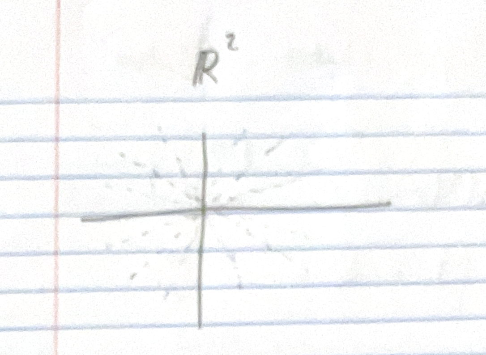

The factor set is turned into a factor space by defining a way to construct linear combinations of elements in the set which result in another element in the set.  If we define an element in the factor set based on the angle of the line from the horizontal, the factor set turns into a factor space because you can add angles and multiply them by scalars and you get angles out.

The factor space is isomorphic to $\R$ on the interval $[0 \pi]$.  The interval is required because the line defined by $\pi + \alpha$ is the same as the line defined by $\alpha$.  This space is essentially the same as the space of one-dimensional real numbers

We need to define addition and multiplication as 

$$a + b = mod_{\pi}(a + b)$$

$$\alpha a = mod_{\pi}(\alpha a)$$

This ensures that the angles stay within the interval

Equation 2.2 holds for this case

$$dim(\R^2 ~ \{0\} / \R) = dim(\R^2 ~ \{0\}) - dim(\R) = 2 - 1 = 1$$

We cannot include the origin in the underlying set because the point at the origin lies aon all of the lines assing through the origin.  This would mean that it is equivalent to all vectors in the factor set, which would mean that every element in the factor set would be equivalent to zero.

## 23

$\pi$ is the permutation that takes (1,2,3) to (3,1,2)

for the standard basis in $\R^3$ defined by $\{e_i\}_{i=1}^3 = \{(1,0,0), (0,1,0), (0,0,1)\}$

$$A_{\pi}e_1 = (0, 1, 0)$$

$$A_{\pi}e_2 = (0, 0, 1)$$

$$A_{\pi}e_3 = (1, 0, 0)$$

## 24

An element in quaternion algebra defined as $q_1 = a_1 + b_1i + c_1j + d_1k$ multiplied iwth another element $q_2 = a_2 + b_2i + c_2j + d_2k$ is

$$q_1q_2 = (a_1a_2 - b_1b_2 - c_1c_2) + (a_1b_2 + b_1a_2 + c_1d_2 - d_1c_2)i + (a_1c_2 - b_1d_2 + c_1a_2 + d_1b_2)j + (a_1d_2 + b_1c_2 - c_1b_2 + d_1a_2)k$$

The identity element in this algebra is 

$$1 = 1 + 0i + 0j + 0k$$

The center of the algebra is the set of all elements that commute with the whole algebra.  So

$$q_1q_2 = q_2q_1$$

where $q_1$ is the center and $q_2$ is an arbitrary element

$$(a_1a_2 - b_1b_2 - c_1c_2) + (a_1b_2 + b_1a_2 + c_1d_2 - d_1c_2)i + (a_1c_2 - b_1d_2 + c_1a_2 + d_1b_2)j + (a_1d_2 + b_1c_2 - c_1b_2 + d_1a_2)k$$
$$=(a_2a_1 - b_2b_1 - c_2c_1) + (a_2b_1 + b_2a_1 + c_2d_1 - d_2c_1)i + (a_2c_1 - b_2d_1 + c_2a_1 + d_2b_1)j + (a_2d_1 + b_2c_1 - c_2b_1 + d_2a_1)k$$

This equation is actually only true if $q_1$ only has a real component, and $b_1 = c_1 = d_1 = 0$.  The reason for this is that multiplying the complex components does not commute.  $ij = -ji$

Therefore $q_1 \in Span\{1\}$ and the algebra is central 

## 25

The vector space $V$ consists of all ordered pairs $v = (a,b)$ where $a,b \in \R$ is a vector space because linera combinations are defined as

$$\alpha v_1 + \beta v_2 = (\alpha a_1 + \beta a_2, \alpha b_1 + \beta b_2)$$

This obeys the rules of a vector space

$$v_1 + v_2 = v_2 + v_1$$

$$v_1 + (v_2 + v_3) = (v_1 + v_2) + v_3$$

zero vector and negative vectors are well defined, and scalar multiplication is distributive

$$\alpha(v_1 + v_2) = \alpha v_1 + \alpha v_2$$

$$(\alpha + \beta) v_1 = \alpha v_1 + \beta v_1$$

If we introduce vector multiplicaation as element wise multiplication

$$v_1v_2 = (a_1a_2, b_1b_2)$$

Then this obeys the required rules of an algebra

$$v_1(\beta v_2 + \gamma v_3) = (a_1(\beta a_2 + \gamma a_3), b_1(\beta b_2 + \gamma b_3)) = (\beta a_1a_2 + \gamma a_1a_3, \beta b_1b_2 + \gamma b_1b_3) = \beta v_1 v_2 + \gamma v_1 v_3$$

and since this is communitive,

$$(\beta v_2 + \gamma v_3)v_1 = \beta v_2v_1 + \gamma v_3v_1 $$

Consider all vector sof the form $w = \begin{pmatrix} 0 & a \\ b & 0 \end{pmatrix}$

These can form a vector space because we construct linear combinations as

$$\alpha w_1 + \beta w_2 = \begin{pmatrix} 0 & \alpha a_1 + \beta a_2 \\ \alpha b_1 + \beta b_2 & 0 \end{pmatrix}$$

And this obeys all of the same rules of the previous example.

We define vector vector multiplication as 

$$w_1 \cdot w_2 = \begin{pmatrix} 0 & a_1a_2 \\ b_1b_2 & 0\end{pmatrix}$$

This is a valid multiplication because

$$w_1 \cdot (\beta w_2 + \gamma w_3) = \begin{pmatrix} 0 & a_1(\beta a_2 + \gamma a_3) \\ b_1(\beta b_2 + \gamma b_3) & 0\end{pmatrix} = \begin{pmatrix} 0 & \beta a_1a_2 + \gamma a_1a_3 \\ \beta b_1b_2 + \gamma b_1b_3 & 0\end{pmatrix} = \beta w_1 \cdot w_2 + \gamma w_1 \cdot w_3$$

A linear homomorphism that maps elements of the first algebra to elements of the second algebra is

$$H((a,b)) = \begin{pmatrix} 0 & a \\ b & 0 \end{pmatrix}$$

H is a linear homomorphism because 

$$H(v_1 \cdot v_2) = \begin{pmatrix} 0 & a_1a_2 \\ b_1b_2 & 0\end{pmatrix} = H(v_1) \cdot H(v_2)$$

This is a bijective homomorphism.  Every point in the codomain is hit exactly once.

## 26

The linear map defined by the matrix

$$\begin{pmatrix} 
1 & 0 & 0 \\ 
0 & cos\theta & -sin\theta \\
0 & sin\theta & cos\theta
\end{pmatrix}$$

Is an automorphism that represents a rotation about the x-axis by the angle $\theta$

Generally, a morphism is a map between vector spaces.  

A Homomorphism is a linear map that satisfies $f(xy) = f(x)f(y)$ 
An isomorphism is a bijective, and signifies that the input space and outputs space are essentially the same
An endomorphism is a linear map from a vector space onto itself
An Automorphism is a bijective linear map from a vector space onto itself

## 27

If I have a basis $\{a_i\}_{i=1}^N$ I can form the vectors $\{T^k a_1\}_{k=0}^M$.  If $M$ is large enough, then these vectors will be linearly dependant, as long as there are more of them then there are dimensions in $V$.  If the vectors are large enough, then by definition there exists some set of coefficients such that 

$$c_0 a_1 + c_1Ta_1 + c_2T^2A_1 + \cdots + c_mT^ma_1 = 0$$

So the polynomial $p_1(T) = c_0 + c_1T + c_2T^2 + \cdots + c_mT^m$ satisfies $p_1(T)a_1 = 0$

And there also exists the polynomials $p_i(T)a_i = 0$

The product of these polynomials is $p(T) = p_1(T)p_2(T)...p_m(T) = 0$ since each $p_i(T)$ suppresses $a_i$

Because this polynomial takes the form

$$c_0I + c_1T + c_2T^2 + \cdots + c_mT^m = 0$$

we can solve this equation for $T^m$ in terms of the lower powers ot $T$

Because of this, an infinite series of the form

$$\sum_{k=0}^{\infty} c_k T^k$$

Can always be expressed as a finite polynomial be large powers of $T$ collapse into linear combinations of small powers of $T$

## 28

The algebra formed from the vector space of all $3 \times 3$ matrices with matrix multiplication defined has the subspace of all matrices of the form

$$\begin{pmatrix}
\alpha & \beta & 0 \\
\gamma & \lambda & 0 \\
0 & 0 & 0
\end{pmatrix}$$

for any arbitrary matrix $X = x_{ij}$

$$\begin{pmatrix}
\alpha & \beta & 0 \\
\gamma & \lambda & 0 \\
0 & 0 & 0
\end{pmatrix}

\begin{pmatrix}
x_{11} & x_{12} & x_{13} \\
x_{21} & x_{22} & x_{23} \\
x_{31} & x_{32} & x_{33} \\
\end{pmatrix} =

\begin{pmatrix}
\alpha x_{11} + \beta x_{21} & \alpha x_{12} + \beta x_{22} & \alpha x_{13} + \beta x_{23} \\
\gamma x_{11} + \lambda x_{21} & \gamma x_{12} + \lambda x_{22} & \gamma x_{13} + \lambda x_{23} \\
0 & 0 & 0 \\
\end{pmatrix}
$$

Therefore, this subspace does not form an ideal

## 29

The map $T : \R^2 \to \R^2$ is defined by 

$$T = \begin{pmatrix}
cos\theta & -sin\theta \\
sin\theta & cos\theta
\end{pmatrix}$$

$$T^{\dag}T = \begin{pmatrix}
cos\theta & sin\theta \\ 
-sin\theta & cos\theta
\end{pmatrix}

\begin{pmatrix}
cos\theta & -sin\theta \\
sin\theta & cos\theta
\end{pmatrix} =

\begin{pmatrix}
cos^2\theta + sin^2\theta & cos\theta sin\theta-sin\theta cos\theta \\
sin\theta cos\theta - cos\theta sin\theta & sin^2\theta + cos^2\theta
\end{pmatrix} = 

\begin{pmatrix}
1 & 0 \\
0 & 1
\end{pmatrix}
$$

For the map 

$$T = \begin{pmatrix}
1 & -i \\
i & 1
\end{pmatrix}$$

$$T^{\dag} T = 

\begin{pmatrix}
1 & -i \\
i & 1
\end{pmatrix} 
\begin{pmatrix}
1 & -i \\
i & 1
\end{pmatrix} =

\begin{pmatrix}
2 & -2i \\
2i & 2
\end{pmatrix} =
2T
$$

## 30

for the vector 

$$|a\rang = \frac{1}{\sqrt{2}} \begin{pmatrix} 0 \\ 1 \\ -1 \\ 0\end{pmatrix}$$

The porjection matrix $P_a$ is

$$P_a = \frac{|a\rang \lang a|}{\lang a | a \rang} = \frac{1}{2}\begin{pmatrix} 0 & 0 & 0 & 0 \\
0  & 1 & -1 & 0 \\
0 & -1 & 1 & 0 \\
0&0&0&0
\end{pmatrix}$$

for an arbitrary vector in $v \in \mathbb{C}^4$

$$P_a v =  \frac{1}{2}\begin{pmatrix} 0 & 0 & 0 & 0 \\
0  & 1 & -1 & 0 \\
0 & -1 & 1 & 0 \\
0&0&0&0
\end{pmatrix}

\begin{pmatrix}
v_1 \\ v_2 \\v_3 \\v_4
\end{pmatrix} = 

\frac{1}{2}
\begin{pmatrix}
0 \\ v_2 - v_3 \\v_3 - v_2 \\ 0
\end{pmatrix} 
$$

So $P_a$ does indeed project $v$ along $a$

The operator defined by $1 - P_a$ is also a projection operator because

$$1 - P_a = \frac{|a\rang \lang a|}{\lang a | a \rang} = \frac{1}{2}\begin{pmatrix} 1 & 0 & 0 & 0 \\
0  & 0 & 1 & 0 \\
0 & 1 & 0 & 0 \\
0&0&0&1
\end{pmatrix}$$

and

$$(1-P_a)^{\dag} = 1 - P_a$$

therefore it is a projection operator

## 31

This problem is describing a projection of all vectors in $\R^3$ onto the plane that is 45 degrees from the $x-y$ plane.

This projection will be 

$$w = v - \frac{v \cdot n}{n \cdot n} n$$

Which is the original vector $v$ minus the component of $v$ that is normal to the plane. For the normal vector $n = (1, 0, 1)$

$$v \cdot n = x \cdot 1 + y \cdot 0 + z \cdot 1 = x + z$$

$$n \cdot n = 2$$

$$w = \begin{pmatrix} x \\ y \\ z \end{pmatrix} - \begin{pmatrix} \frac{x + z}{2} \\ 0 \\ \frac{x + z}{2}\end{pmatrix} = \begin{pmatrix} \frac{x - z}{2} \\ y \\ \frac{z-x}{2} \end{pmatrix}$$

Expressed in the basis $b_1 = (0,-1,0)$, $b_2 = (-\frac{1}{\sqrt{2}}, 0, \frac{1}{\sqrt{2}})$

$$w = -y \begin{pmatrix} 0 \\ -1 \\ 0\end{pmatrix} + \frac{\sqrt{2}(z - x)}{2}\begin{pmatrix} -\frac{1}{\sqrt{2}} \\ 0 \\ \frac{1}{\sqrt{2}}\end{pmatrix}$$

The mapping from $v$ to $w$ expressed as a matrix is

$$\begin{pmatrix} 0 & -1 & 0 \\  -\frac{\sqrt{2}}{2} & 0 & \frac{\sqrt{2}}{2}\end{pmatrix}$$

For the specific vector $(1, 0, 2)$

$$Av = \begin{pmatrix} 0 \\\frac{\sqrt{2}}{2} \end{pmatrix}$$

## 32

The transformation 

$$T(x_1,x_2,x_3) = (x_1 + x_2 - x_3, 2x_1 - x_3, x_1 + 2x_2)$$

Expressed as a matrix is

$$\begin{pmatrix} 1 & 1 & -1 \\ 2 & 0 & -1 \\ 1 & 2 & 0\end{pmatrix}$$

Then, expressing $(x,y,z)$ in the basis $\{(1,1,0), (1,0,-1), (0,2,3)\}$

$$\begin{pmatrix} x \\ y \\ z\end{pmatrix} = \begin{pmatrix}1 & 1 & 0 \\ 1 & 0 & -1 \\ 0 & 2 & 3\end{pmatrix} \begin{pmatrix} a \\ b \\ c\end{pmatrix}$$

So $T$ expressed in the new basis is

$$\begin{pmatrix}1 & 1 & 0 \\ 1 & 0 & -1 \\ 0 & 2 & 3\end{pmatrix}^{-1} \begin{pmatrix} 1 & 1 & -1 \\ 2 & 0 & -1 \\ 1 & 2 & 0\end{pmatrix}\begin{pmatrix}1 & 1 & 0 \\ 1 & 0 & -1 \\ 0 & 2 & 3\end{pmatrix} = \begin{pmatrix}5 & 3 & -3 \\ -3 & -4 & -1 \\ 3 & 3 & 0\end{pmatrix}$$

The transformation $T$ in the new basis is equivalent to a transformation from that basis into the old basis, then the transformation itself, then a transformation back into the new basis.

## 33

$$(U+T)(U-T) = U^2 + TU - UT - T^2$$

If $[U,T] = 0$ then $UT = TU$, and 

$$(U + T)(U - T) = U^2 - T^2$$

## 34

$$U(\alpha_1, \alpha_2) = \begin{pmatrix} i \frac{\alpha_1}{\sqrt{2}} - i \frac{\alpha_2}{\sqrt{2}} \\ \frac{\alpha_1}{\sqrt{2}} + \frac{\alpha_2}{\sqrt{2}}\end{pmatrix}$$

$$U = \begin{pmatrix} \frac{i}{\sqrt{2}} & -\frac{i}{\sqrt{2}} \\ \frac{1}{\sqrt{2}} & \frac{1}{\sqrt{2}}\end{pmatrix}$$

$$U^{\dag} = \begin{pmatrix} -\frac{i}{\sqrt{2}} & \frac{1}{\sqrt{2}} \\ \frac{i}{\sqrt{2}} & \frac{1}{\sqrt{2}}\end{pmatrix}$$

$$UU^{\dag} = \begin{pmatrix} \frac{i}{\sqrt{2}} & -\frac{i}{\sqrt{2}} \\ \frac{1}{\sqrt{2}} & \frac{1}{\sqrt{2}}\end{pmatrix} \begin{pmatrix} -\frac{i}{\sqrt{2}} & \frac{1}{\sqrt{2}} \\ \frac{i}{\sqrt{2}} & \frac{1}{\sqrt{2}}\end{pmatrix} = \begin{pmatrix} 1 & 0 \\ 0 & 1\end{pmatrix}$$

Therefore $U$ is unitary

## 35

For the derivative operation $D : P_4^c[t] \to P_3^c[t]$, the matrix representation is

$$\begin{pmatrix} 0 & 1 & 0 & 0 & 0 \\
                  0 & 0 & 2 & 0 & 0 \\
                  0 & 0 & 0 & 3 & 0 \\
                  0 & 0 & 0 & 0 & 4 \end{pmatrix}$$

For an arbitrary polynomial of degree $4$ defined by $a + bt + ct^2 + dt^3 + et^4$

The first derivative is 

$$\begin{pmatrix} 0 & 1 & 0 & 0 & 0 \\
                  0 & 0 & 2 & 0 & 0 \\
                  0 & 0 & 0 & 3 & 0 \\
                  0 & 0 & 0 & 0 & 4 \end{pmatrix} \begin{pmatrix} a \\ b \\ c \\ d \\ e\end{pmatrix} = 
\begin{pmatrix} b \\ 2c \\ 3d \\ 4e \end{pmatrix}
$$

And the second derivative is

$$\begin{pmatrix} 0 & 1 & 0 & 0 & 0 \\
                  0 & 0 & 2 & 0 & 0 \\
                  0 & 0 & 0 & 3 & 0 \\
                  0 & 0 & 0 & 0 & 4 \end{pmatrix} \begin{pmatrix} b \\ 2c \\ 3d \\ 4e \\ 0\end{pmatrix} = 
\begin{pmatrix} 2c \\ 6d \\ 12e \\ 0 \end{pmatrix}
$$

The third derivative is

$$\begin{pmatrix} 0 & 1 & 0 & 0 & 0 \\
                  0 & 0 & 2 & 0 & 0 \\
                  0 & 0 & 0 & 3 & 0 \\
                  0 & 0 & 0 & 0 & 4 \end{pmatrix} \begin{pmatrix} 2c \\ 6d \\ 12e \\ 0 \\ 0\end{pmatrix} = 
\begin{pmatrix} 6d \\ 24e \\ 0  \\ 0\end{pmatrix}
$$

The fourth derivative is

$$\begin{pmatrix} 0 & 1 & 0 & 0 & 0 \\
                  0 & 0 & 2 & 0 & 0 \\
                  0 & 0 & 0 & 3 & 0 \\
                  0 & 0 & 0 & 0 & 4 \end{pmatrix} \begin{pmatrix} 6d \\ 24e \\ 0 \\ 0 \\ 0\end{pmatrix} = 
\begin{pmatrix} 24e \\ 0  \\ 0 \\ 0\end{pmatrix}
$$

The fifth derivative is

$$\begin{pmatrix} 0 & 1 & 0 & 0 & 0 \\
                  0 & 0 & 2 & 0 & 0 \\
                  0 & 0 & 0 & 3 & 0 \\
                  0 & 0 & 0 & 0 & 4 \end{pmatrix} \begin{pmatrix} 24e \\ 0 \\ 0 \\ 0 \\ 0\end{pmatrix} = 
\begin{pmatrix} 0 \\ 0  \\ 0 \\ 0\end{pmatrix}
$$

For the multiply by t operation $T : P_3^c[t] \to P_4^c[t]$ the matrix representation is

$$\begin{pmatrix} 0 & 0 & 0 & 0 \\
                  1 & 0 & 0 & 0 \\
                  0 & 1 & 0 & 0 \\
                  0 & 0 & 1 & 0 \\
                  0 & 0 & 0 & 1 \end{pmatrix}$$

For an arbitrary polynomial of degree $3$ defined by $a + bt + ct^2 + dt^3$, the result of the operation $T$ on this vector is

$$\begin{pmatrix} 0 & 0 & 0 & 0 \\
                  1 & 0 & 0 & 0 \\
                  0 & 1 & 0 & 0 \\
                  0 & 0 & 1 & 0 \\
                  0 & 0 & 0 & 1 \end{pmatrix} \begin{pmatrix} a \\ b \\ c \\ d\end{pmatrix} = 
                  \begin{pmatrix} 0 \\ a \\ b \\ c \\ d\end{pmatrix}$$

## 36

The matrix representation of $T(x,y,z) = (x + y - z, 2x + 3y - 2z, x - y)$ is

$$\begin{pmatrix} 1 & 1 & -1 \\ 2 & 3 & -2 \\ 1 & -1 & 0\end{pmatrix}$$

And the trace is the sum of diagonal elements

$$tr(T) = 4$$

## 37

Consider the vector space

$$\R^3 = \R^2 \oplus \R$$

The projection $P_1$ onto $\R^2$ is

$$P_1 = \begin{pmatrix} 1 & 0 & 0 \\ 0 & 1 & 0 \\ 0 & 0 & 0 \end{pmatrix}$$

and the projection $P_2$ onto $\R$ is

$$P_2 = \begin{pmatrix} 0 & 0 & 0 \\ 0 & 0 & 0 \\ 0 & 0 & 1 \end{pmatrix}$$

These are valid porjection operators because

$$P_1P_2 = P_2P_1 = 0$$

$$P_1^2 = P_1$$

$$P_2^2 = P_2$$

$$P_1 + P_2 = I$$

For any arbitrary vecotr in $\R^3$ defined by $v = (x,y,z)$

$$P_1 v = \begin{pmatrix} x \\ y \\ 0 \end{pmatrix}$$

and

$$P_2 v = \begin{pmatrix} 0 \\ 0 \\ z \end{pmatrix}$$

These vectors are orthogonal because

$$\begin{pmatrix} x & y & 0 \end{pmatrix} \begin{pmatrix} 0 \\ 0 \\ z\end{pmatrix} = 0$$

This arbitrary vector can be decomposed into two vectors by

$$v = (P_1 + I - P_1)v = \begin{pmatrix} x \\ y \\ 0 \end{pmatrix} + \begin{pmatrix} 0 \\ 0 \\ z\end{pmatrix}$$

with the first being in $\R^2$ and the second being in $\R$

Only the zero vector exists in both of these subspaces

the vector spaces that are outputs of the mappings $P_1$ and $P_2$ are invariant subspaces, and are orthogonal compliments to each other.  While this one was a somewhat trivial example, there could be other more complicated examples that have the same principles

## 38

$$A = \begin{pmatrix} 1 & 1 \\ 0 & i\end{pmatrix}$$

The eigenvlaue problem for this matrix is

$$(A - \lambda I)x = 0$$

$$det(A - \lambda I) = (1 - \lambda)(i - \lambda) = 0$$

The solutions to this equation are

$$\lambda = 1, i$$

Plugging in $\lambda = 1$

$$\begin{pmatrix} 0 & 1 \\ 0 & i-1\end{pmatrix} \begin{pmatrix} x_1 \\ x_2\end{pmatrix} = \begin{pmatrix} 0 \\ 0 \end{pmatrix}$$

gives

$$x = \begin{pmatrix} 1 \\ 0\end{pmatrix}$$

Plugging in $\lambda = i$

$$\begin{pmatrix} 1-i & 1 \\ 0 & 0\end{pmatrix} \begin{pmatrix} x_1 \\ x_2\end{pmatrix} = \begin{pmatrix} 0 \\ 0 \end{pmatrix}$$

gives

$$x = \begin{pmatrix} 1 \\ i-1\end{pmatrix}$$

Following the same procedure for 

$$B  = \begin{pmatrix} 1 & 0 & 0 \\ 0 & 1 & 0 \\ 0 & 0 & 0 \end{pmatrix}$$

we find 

$$\lambda = 1,1$$

$$x = \begin{pmatrix} 1 \\ 0 \\ 0 \end{pmatrix}, \begin{pmatrix} 0 \\ 1 \\ 0\end{pmatrix}$$

$$\lambda = 0$$

$$x = \begin{pmatrix} 0 \\ 0 \\ 1 \end{pmatrix} $$
For the matrix $A$, 

$$A^{\dag} = \begin{pmatrix} 1 & 0 \\ 1 & -i \end{pmatrix}$$

This shows that it is not normal ($AA^{\dag} \ne A^{\dag}A$), unital ($AA^{\dag} \ne I$), or Hermitian ($A \ne A^{\dag}$).  But it is full rank because the columns are linearly independant.

It is also diagonalizable by 

$$A = X^T \Lambda X$$

where $X$ is the matrix of eigenvectors and $\Lambda$ is a diagonal matrix of eigenvalues

technically $B$ is already in diagonal form with its eigenvalues on its diagonal if you count $\lambda  = 0$ as one of its eigenvalues

The eigenspace corresponding to $\lambda = 1$ is $span\{(1,0,0), (0,1,0)\}$ and the eigenspace corresponding to $\lambda = 0$ is $span\{(0,0,1)\}$.  These two spaces reduce $B$

## 39

For the vectors

$$a_1 = \begin{pmatrix} \frac{1}{\sqrt{2}} \\ \frac{1}{\sqrt{6}} \\ \frac{1+i}{\sqrt{6}}\end{pmatrix}$$
$$a_2 = \begin{pmatrix} \frac{-i}{\sqrt{2}} \\ \frac{i}{\sqrt{6}} \\ \frac{-1+i}{\sqrt{6}}\end{pmatrix}$$
$$a_3 = \begin{pmatrix} 0 \\ \frac{-2}{\sqrt{6}} \\ \frac{1+i}{\sqrt{6}}\end{pmatrix}$$

The matrix that perforrms the cchange of basis from the standard $\mathbb{C}^3$

$$A = \begin{pmatrix} \frac{1}{\sqrt{2}} & \frac{-i}{\sqrt{2}} &  0  \\
                        \frac{1}{\sqrt{6}} & \frac{i}{\sqrt{6}} & \frac{-2}{\sqrt{6}} \\
                        \frac{1+i}{\sqrt{6}}& \frac{-1+i}{\sqrt{6}} & \frac{1+i}{\sqrt{6}}\end{pmatrix}$$

This matrix is unitarty because

$$AA^{\dag} = \begin{pmatrix} \frac{1}{\sqrt{2}} & \frac{-i}{\sqrt{2}} &  0  \\
                        \frac{1}{\sqrt{6}} & \frac{i}{\sqrt{6}} & \frac{-2}{\sqrt{6}} \\
                        \frac{1+i}{\sqrt{6}}& \frac{-1+i}{\sqrt{6}} & \frac{1+i}{\sqrt{6}}\end{pmatrix}
\begin{pmatrix} \frac{1}{\sqrt{2}} & \frac{1}{\sqrt{6}} & \frac{1-i}{\sqrt{6}} \\
                        \frac{i}{\sqrt{2}} & \frac{-i}{\sqrt{6}} & \frac{-1-i}{\sqrt{6}} \\
                         0 & \frac{-2}{\sqrt{6}} & \frac{1-i}{\sqrt{6}}\end{pmatrix}

                         =
\begin{pmatrix} 1 & 0 & 0 \\ 0 & 1 & 0 \\ 0 & 0 & 1\end{pmatrix} 
$$

## 40

Isomorphisms, Automorphisms, and Homomorphism are all mappings from one space to another

Isomorphisms are maps that are bijective, meaning that there is a one to one correspondence between inputs and outputs, which essentially maeans that the two spaces are pretty much equivalent

Automorphisms are also bijective maps but now the input and output spaces are literally the same space

Homomorphisms do not have to be bijective, but ther preserve the structure of addition and multiplication from the input space to the output space.  meaning

$$\phi(x+y) = \phi(x) + \phi(y)$$

and

$$\phi(xy) = \phi(x)\phi(y)$$

For the set $\{0,1,2,3\}$ with multiplication being defined as addition modulo 4, the multiplication table is

$$\begin{array}{c|ccc} & 0 & 1 & 2  & 3 \\
\hline
0 & 0 & 1 & 2 & 3 \\
1 & 1 & 2 & 3 & 0 \\
2 & 2 & 3 & 0 & 1\\
3 & 3 & 0 & 1 & 2
 \end{array}$$

There is closure because multiplying an element by another element always gives a result that is also int the set

The identity element in this scenario is $0$ because if you multiply anything by $0$ you get the same thing back as shown by the first column of the table.  

The inverse of an element $a$ is the solution to the equation 

$$a^{-1} = 4 - a$$

This means that an element's inverse is the number that results in $4$ when you add it to the element, this will give the identity $0$, meaning $a^{-1}$ is the inverse of $a$

The mapping $T(g) = g+1$ is an automorphism because it is a bijective map onto istelf, the inverse being $T^{-1}(g) = g-1$

It is not a homomorphism because $T(0\cdot0) = T(0) = 1 \ne T(0)\cdot T(0) = 1\cdot1 = 2$

Applying the mapping to each element in the multiplication table, we obtain

$$\begin{array}{c|ccc} & 0 & 1 & 2  & 3 \\
\hline
0 & 1 & 2 & 3 & 0 \\
1 & 2 & 3 & 0 & 1 \\
2 & 3 & 0 & 1 & 2\\
3 & 0 & 1 & 2 & 3
 \end{array}$$

For the mapping $T : G \to H$  defined by $T(g) = 0$ if $g = 0,2$, and $T(g) = 1$ if $g=1,3$

$T$ is not an isomorphism or automorphism because it is not injective.

$T$ is a homomorphism because the multiplication table of $T(a)T(b)$ is now

$$\begin{array}{c|ccc} & 0 & 1 & 0  & 1 \\
\hline
0 & 0 & 1 & 0 & 1 \\
1 & 1 & 0 & 1 & 0 \\
0 & 0 & 1 & 0 & 1\\
1 & 1 & 0 & 1 & 0
 \end{array}$$

Which is the same as the multiplication table of $T(ab)$

$$\begin{array}{c|ccc} & 0 & 1 & 2  & 3 \\
\hline
0 & 0 & 1 & 0 & 1 \\
1 & 1 & 0 & 1 & 0 \\
2 & 0 & 1 & 0 & 1\\
3 & 1 & 0 & 1 & 0
 \end{array}$$

For the mapping $T : G \to M$ defined by $\{0,1,2,3\} \to \{1,2,3,4\}$ with multiplication being addition modulo $5$, the new set $M$ is not a groupd because $4 \cdot 1 = 0$ which is not in the set $M$

The new multiplication table is

$$\begin{array}{c|ccc} & 1 & 2 & 3  & 4 \\
\hline
1 & 2 & 3 & 4 & 0 \\
2 & 3 & 4 & 0 & 1 \\
3 & 4 & 0 & 1 & 2\\
4 & 0 & 1 & 2 & 3
 \end{array}$$

This is an isomorhpism because it is bijective, but not an automorphism because the input and output sets are not the same.

$T$ is not a homomorphism either because $T(0 \cdot 0) = 1 \ne T(0) \cdot T(0) = 2$ 

## 41

For the matrix 

$$A = \begin{pmatrix} 2 & -12 \\ 1 & -5 \end{pmatrix}$$

The largest eigenvalue can be approximated by

$$\lambda_1 = \frac{\lang y, A^{m+1}x \rang}{\lang y, A^mx \rang}$$

where $x$ and $y$ are arbitrary vectors in $\R^2$.  Using $m=20$, and random vectors for $x$ and $y$

$$\lambda_1 = -2 $$

An eigenvector associated with this eigenvalue is the solution to 

$$\begin{pmatrix} 4 & -12 \\ 1 & -3\end{pmatrix} \begin{pmatrix} x_1 \\ x_2 \end{pmatrix} = \begin{pmatrix} 0 \\ 0\end{pmatrix}$$

which is 

$$\begin{pmatrix} 3 \\ 1
\end{pmatrix}$$

## 42

Any arbitrary matrix $A$ can be written as 

$$A = UR$$

Where $U$ is a unitary matrix and $R^2 = A^{\dag}A$ 

Then 

$$A^{\dag}A = R^2$$

and

$$AA^{\dag} = U R^2 U^{\dag}$$

Since $U$ is unitary, $U R^2 U^{\dag}$ has the same eigenvalues as $R^2$ because it's essentially a rotation then the same operator then a rotation back 

## 46

$$(1+x)^{\alpha} = 1 + \alpha x + \frac{\alpha (\alpha - 1)}{2!}x^2 + \frac{\alpha(\alpha-1)(\alpha-2)}{3!}x^3 + \cdots$$

For $\alpha = \frac{1}{2}$

$$(1 + x)^{\frac{1}{2}} = 1 + \frac{x}{2} - \frac{x^2}{8} + \frac{x^3}{16} -\frac{5x^4}{128} + \frac{7x^5}{256} + \cdots $$

The radius of convergence is

$$R = \lim_{k \to \infty} \left| \frac{a_k}{a_{k+1}} \right| = \lim_{k \to \infty} \left| \frac{\frac{1}{2} - k}{k+1}\right| = 1$$

For small values of $x$, the higher order terms vanish, and we are left with 

$$\frac{1}{\sqrt{1 + x}} \approx 1 - \frac{x}{2}$$

For $\frac{1}{1 + x}$ the series is

$$\frac{1}{1+x} = 1 - x + x^2 - x^3 + \cdots$$

The radius of convergence is

$$R = \lim_{k \to \infty} \left| -1 \right| = 1$$

After looking into this a little bit, this is called a geometric series because each term is found by multiplying the previous one by a common ratio

The power series of $\frac{1}{1+z}$ and $\frac{1}{1-z}$ are

$$\frac{1}{1+z} = 1 - z + z^2 - z^3 + \cdots$$

and 

$$\frac{1}{1-z} = 1 + z + z^2 + z^3 + \cdots$$

Both of which have radius of convergence $R=1$

$$\frac{1}{z - i + 1} = \frac{1}{1-i}\frac{1}{1 + \frac{z}{1-i}} = \sum_{k=0}^{\infty}\frac{-1^k}{(1 + i)^k}z^k$$

With $R = \left|1 - i \right|$

$$\frac{3}{1 - \frac{z}{2}} = \sum_{k=0}^{\infty} 3 \frac{z^k}{2^k}$$

with $R = 2$

By partial fraction decomposition

$$\frac{1}{z(1+z)} = \frac{1}{z} - \frac{1}{1+z} = \frac{1}{z} - \sum_{k=0}^{\infty}(-1^k) z^k$$

With $R=1$, though this is undefined at zero as well.

## 48

To find the fourier seires of

$$f(x) = \begin{cases} \sin (\omega x)& \text{if } 0 \le x \le \pi/\omega \\ 0 & \text{if } -\pi/ \omega \le x \le 0 \end{cases}$$

We construct

$$f(x) \approx a_0 + \sum_{n=1}^{N} \left[ a_n \cos(n \omega_0 x) + b_n \sin(n \omega_0 x) \right]$$

where

$$a_0 = \frac{\omega}{2\pi} \int_{-\pi/\omega}^{\pi/\omega} \sin(\omega x) dx = \frac{1}{\pi}$$

$$a_n = \frac{\omega}{\pi} \int_{-\pi/\omega}^{\pi/\omega} \sin(\omega x) \cos(n \omega x) dx = \frac{\cos n \pi + 1}{\pi (1 - n^2)} $$

$$b_1 = \frac{\omega}{\pi} \int_{-\pi/\omega}^{\pi/\omega} \sin^2(\omega x) dx = \frac{1}{2}$$

$$b_n = \frac{\omega}{\pi} \int_{-\pi/\omega}^{\pi/\omega} \sin( \omega x)\sin(n \omega x) dx = \frac{\sin n \pi}{\pi (1 - n^2)} = 0$$

For $N = 6$

$$f(x) \approx \frac{1}{\pi} + \frac{1}{2} \sin(\omega x) -\frac{2}{3\pi} \cos(2 \omega x) - \frac{2}{15\pi} \cos(4 \omega \pi) - \frac{2}{35\pi} \cos(6 \omega \pi)$$

Including more terms,

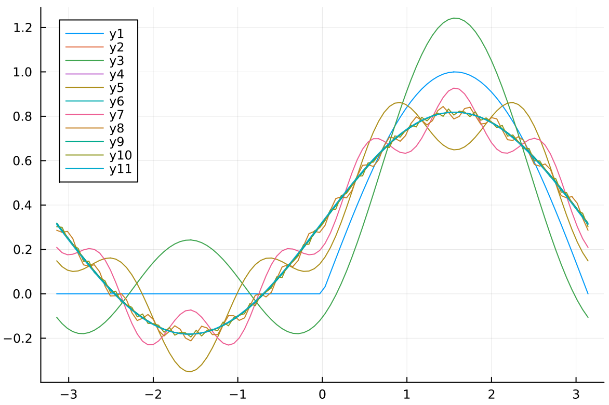

Something went wrong here but I don't know what and I need to move on

## 49

Let $A = \begin{pmatrix} 1 & \alpha \\ 0 & 1 \end{pmatrix}$

For an arbitrary matrix

$$R = \begin{pmatrix} a & b \\ c & d \end{pmatrix}$$

It's inverse is defined as

$$R^{-1} = \frac{1}{ad - bc} \begin{pmatrix} d & -b \\ -c & a \end{pmatrix}$$

Then

$$RAR^{-1} = \frac{1}{ad - bc}\begin{pmatrix} a & b \\ c & d\end{pmatrix}\begin{pmatrix} 1 & \alpha \\ 0 & 1\end{pmatrix}\begin{pmatrix} d & -b \\ -c & a\end{pmatrix}$$

$$ = \frac{1}{ad-bc} \begin{pmatrix} a & b \\ c & d\end{pmatrix} \begin{pmatrix} d - c \alpha & a\alpha - b \\ -c & a\end{pmatrix}$$
 
$$= \begin{pmatrix} ad - bc - ca\alpha & a^2 \alpha \\ -c^2 \alpha & ad - bc + ac\alpha\end{pmatrix}$$

In order for this to be diagonal, $a$ and $c$ must be $0$, but then the diagonal terms become $0$ as well, which just creates the $0$ matrix

If $A$ were, normal, it would be diagonalizable, and we could construct

$$A = R^{-1}DR$$

where $D$ is diagonal. Rearranging this

$$D = RAR^{-1}$$

And we know this is impossible

## 50

For any arbitrary matrix $A$, there exists a unitary matrix $U$ such that 

$$UAA^{\dag}U^{\dag} = D^2$$

where $D$ is a diagonal matrix

Then we defined the vatrix

$$V = A^{\dag}U^{\dag}D^-1$$

And we can write

$$UAV = UAA^{\dag}U^{\dag}D^-1 = D^2D^{-1} = D$$

## 51

The operator $-i d/dx$ is differentiation and multiplication by $-i$, and the eigenvalue problem for this is

$$-i \frac{df}{dx} = \lambda f(x)$$

which is a first order differential equation.  The eigenvectors are the solutions to this ODE of the form

$$f(x) = Ce^{-\lambda x/ i}$$

And the eigenvalues $\lambda$ can be any real number

## 52

$$f(x) = \cos \pi x = \sum_{n=0}^{\infty} a_n P_n(x)$$

$$a_0 = \frac{1}{2}\int_{-1}^1 \cos \pi x dx = 0 $$

$$a_1 = \frac{3}{2} \int_{-1}^1 x \cos \pi x dx = 0$$

$$a_2 = \frac{5}{2} \int_{-1}^1 \frac{1}{2}(3x^2 - 1) \cos \pi x dx = -\frac{15}{\pi^2}$$

$$a_3 = 0$$

$$a_4 = \frac{9}{2} \int_{-1}^1 \frac{1}{8} (35x^4 - 30x^2 + 3) \cos \pi x dx = \frac{9(210 - 20 \pi^2)}{2 \pi^4}$$

$$a_5 = 0$$

$$a_6 = \frac{13}{2} \int_{-1}^1 \frac{1}{16} (231x^6 - 315x^4 + 105x^2 - 5) \cos \pi x dx = -\frac{273(495 - 60\pi^2 + \pi^4)}{\pi^6}$$

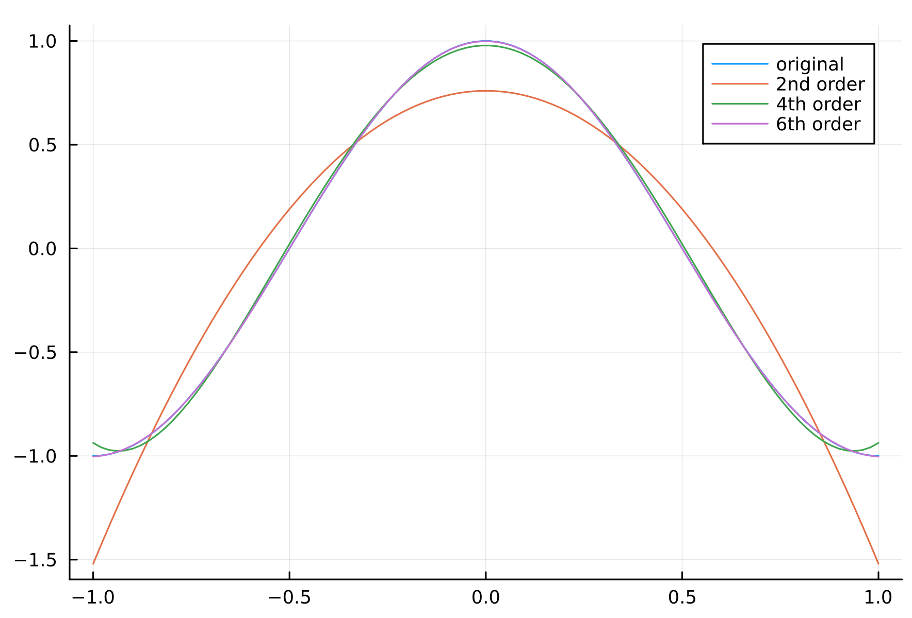

For the Heaviside function

$$F(x) = \begin{cases} 0 & \text{if } x < 0  \\ 1 & \text{if } x > 0\end{cases}$$

The formula for coefficients is 

$$a_n = \frac{1}{\sqrt{\pi}2^n n!} \int_{-\infty}^{\infty} F(x) H_n(x) e^{-x^2} dx$$

The first $6$ coefficients are

$$a_0 = \frac{1}{\pi}\int_0^{\infty} e^{-x^2} dx = \frac{1}{2}$$

$$a_1 = \frac{1}{2\pi}\int_0^{\infty} 2xe^{-x^2} dx = \frac{1}{2 \sqrt{\pi}}$$

$$a_2 = \frac{1}{8\pi}\int_0^{\infty} (4x^2 - 2)e^{-x^2} dx = 0$$

$$a_3 = \frac{1}{48\pi}\int_0^{\infty} (8x^3 - 12x)e^{-x^2} dx = -\frac{1}{24 \sqrt{\pi}}$$

$$a_4 = 0$$

$$a_5 = \frac{1}{320 \sqrt{\pi}}$$

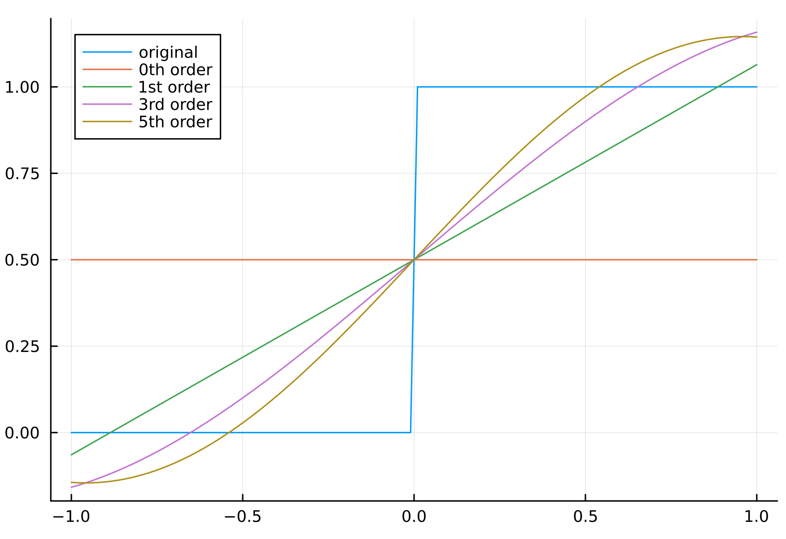

## 53

$$\int_{-\infty}^{\infty} f(x) \delta (g(x)) dx = \sum_k \frac{f(x_k)}{|g'(x_k)|}$$

This is the sum of the values of $f(x)$ evaluated at the roots of $g(x)$ and scaled by the derivatives of $g(x)$ at those points

$$\int_{-\infty}^{\infty} (3x^2 - 7x + 2)\delta(x^2 - 5x + 6) dx = \frac{8}{|1|} + 0 = 8$$

## 54

normal: $A^{\dag}A = AA^{\dag}$

unitary: $A^{\dag}A = AA^{\dag} = I$

hermitian: $A = A^{\dag}$

ant-hermitian: $A = -A^{\dag}$

orthogonal: $A^TA = AA^T$ (defined on the reals, unitary is for complex)

symmetric: $A = A^T$

anti-symmetric: A = -A^T

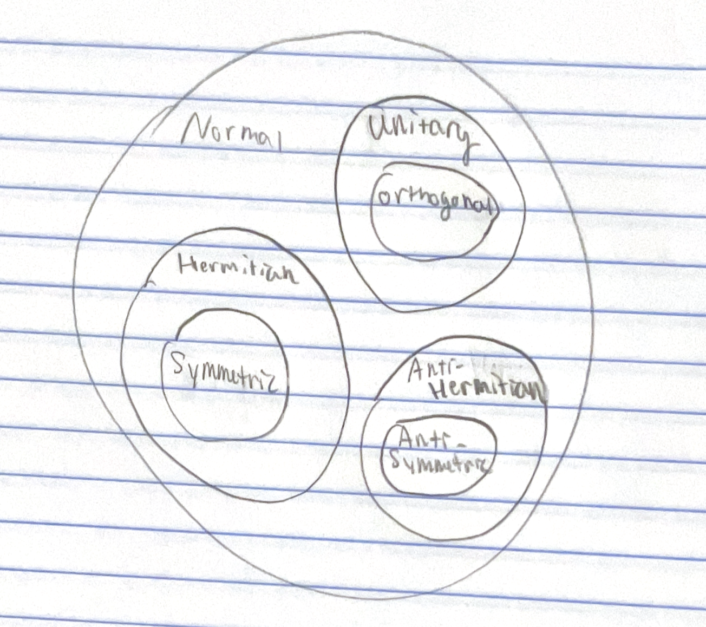

These types of normal matrices are useful because they are diagonalizable, and diagonal matrice are always easier to work with

Spectral decomposition is important because it is a method by which we diagonalize a matrix, changing the basis to work in the diagonalized coordinates

## 55

For the three mass system, the equations of motion are

$$\frac{d^2u_1}{dt^2} = \frac{k}{m} (u_2 - 2u_1)$$
$$\frac{d^2u_2}{dt^2} = \frac{k}{m} (u_1 - 2u_2 + u_3)$$
$$\frac{d^2u_3}{dt^2} = \frac{k}{m} (u_2 - 2u_3)$$

This is the linear system of equations

$$\begin{pmatrix}\ddot{u}_1 \\ \ddot{u}_2 \\ \ddot{u}_3 \\ \dot{u}_1 \\ \dot{u}_2 \\ \dot{u}_3 \end{pmatrix} = \begin{pmatrix} 0 & 0 & 0 & -\frac{2k}{m} & \frac{k}{m} & 0 \\ 0 & 0 & 0 & \frac{k}{m} & -\frac{2k}{m} & \frac{k}{m}\\ 0 & 0 & 0 & 0 & \frac{k}{m} & -\frac{2k}{m} \\ 1 & 0 & 0 & 0 & 0 & 0 \\ 0 & 1 & 0 & 0 & 0 & 0  \\0 & 0 & 1 & 0 & 0 & 0 \end{pmatrix}\begin{pmatrix}\dot{u}_1 \\ \dot{u}_2 \\ \dot{u}_3 \\ u_1 \\ u_2 \\ u_3 \end{pmatrix}$$

The solution to this system of ODEs is 

$$\mathbf{u}(t) = e^{At} \mathbf{u}_0$$

where 

$$A = \begin{pmatrix} 0 & 0 & 0 & -\frac{2k}{m} & \frac{k}{m} & 0 \\ 0 & 0 & 0 & \frac{k}{m} & -\frac{2k}{m} & \frac{k}{m}\\ 0 & 0 & 0 & 0 & \frac{k}{m} & -\frac{2k}{m} \\ 1 & 0 & 0 & 0 & 0 & 0 \\ 0 & 1 & 0 & 0 & 0 & 0  \\0 & 0 & 1 & 0 & 0 & 0 \end{pmatrix}$$

and

$$\mathbf{u} = \begin{pmatrix}\dot{u}_1 \\ \dot{u}_2 \\ \dot{u}_3 \\ u_1 \\ u_2 \\ u_3 \end{pmatrix}$$

given the initial conditions

$$\mathbf{u}_0 = \begin{pmatrix}0 \\ 0 \\ 0 \\ -1 \\ 1 \\ 2 \end{pmatrix}$$

and parameters $k = 1$, $m = 1$

The resulting trajectory is plotted in time

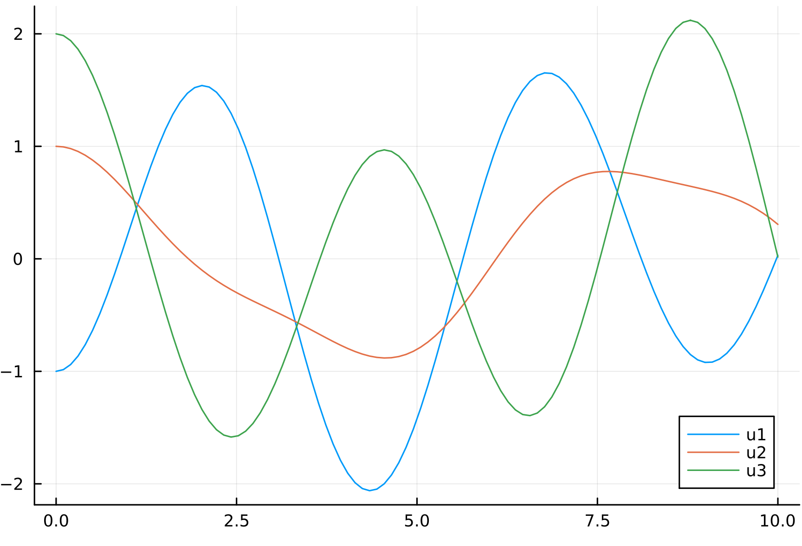

## 56

The solutions to 

$$sin(z) = 0$$

Are only real numbers because

$$sin(z) = \frac{e^{iz} - e^{-iz}}{2i}$$

plugging into the original equation to find the roots,

$$e^{iz} = e^{-iz}$$

$$e^{2iz} = 1$$

This is only true if 

$$2iz = 2 \pi i n$$

where $n \in \Z$

therefore $z = n \pi \in \R$

Same thing goes for $cos(z)$, but the roots are $z = n \pi + \frac{\pi}{2}$

## 57

The If the spectral decomposition of $A$ is 

$$A = X \Lambda X^{\dag}$$

Then the spectral decomposition of $A^{\dag}$ is

$$A^{\dag} = (X \Lambda X^{\dag})^{\dag} = X \Lambda^{\dag} X^{\dag}$$

The spectral decomposition of $A^{-1}$ is

$$A^{-1} = (X \Lambda X^{\dag})^{-1} = X \Lambda^{-1} X^{\dag}$$

And the spectral decomposition of $AA^{\dag}$ is

$$AA^{\dag} = X \Lambda X^{\dag} X \Lambda^{\dag} X^{\dag} = X \Lambda \Lambda^{\dag} X^{\dag}$$

## 59

The Fourier series expansion of $f(x)$ is

$$F(x) = \frac{1}{2}A_0 + \sum_{n=1}^{\infty} \left( A_n \cos \frac{2 n \pi x}{L} + B_n \sin \frac{2 n \pi x}{L} \right)$$

$$A_n = \frac{2}{L} \int_a^b \cos \frac{2 n \pi x}{L} F(x) dx$$
$$B_n = \frac{2}{L} \int_a^b \sin \frac{2 n \pi x}{L} F(x) dx$$

to expand the function $f(x) = |x|$ in the fourier basis,

$$a_0 = \frac{1}{2a} \int_{-a}^0 -x dx + \frac{1}{a} \int_0^{a} x dx = \frac{a}{4} + \frac{a}{4} = \frac{a}{2}$$

$$a_1 = \frac{1}{a} \int_{-a}^0 -x \cos \left(\frac{\pi x}{a}\right) dx + \frac{1}{a} \int_0^{a} x \cos \left(\frac{\pi x}{a}\right) dx = -\frac{2 a}{\pi^2} - \frac{2a}{\pi^2} = -\frac{4a}{\pi^2}$$

$$a_3 = \frac{1}{a} \int_{-a}^0 -x \cos \left(\frac{3 \pi x}{a}\right) dx + \frac{1}{a} \int_0^{a} x \cos \left(\frac{3\pi x}{a}\right) dx = -\frac{2 a}{9\pi^2} - \frac{2a}{9\pi^2} = -\frac{4a}{9\pi^2}$$

$$a_5 = -\frac{4 a}{25 \pi^2}$$

$$a_{2n+1} = -\frac{4a}{(2\pi n+\pi)^2}$$

$$\boxed{|x| = \frac{a}{2} - \underset{n=0}{\overset{\infty}{\sum}} \frac{4a}{(2\pi n+\pi)^2} \cos\left( \frac{(2\pi n + \pi)x}{a}\right)}$$

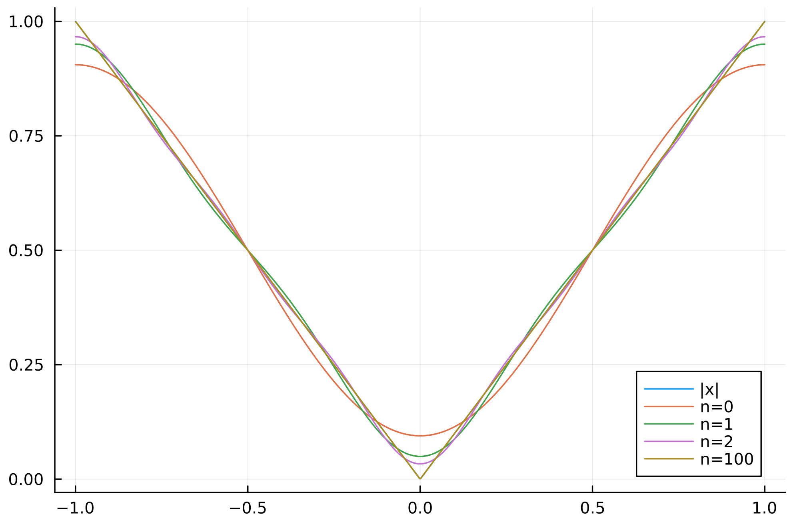

If we evaluate this expansion at $x=0$, and plugging in $a = \pi^2$ we get

$$0 = \frac{\pi^2}{2} - \underset{n=0}{\overset{\infty}{\sum}} \frac{4 \pi^2}{(2\pi n+\pi)^2} $$

Rearranging

$$\pi^2  = \underset{n=0}{\overset{\infty}{\sum}} \frac{8}{(2 n+1)^2} $$

## 71

### $G_{\Delta}$

$$\begin{array}{c|cccccc} 

& I & R_1 & R_2 & F_1 & F_2 & F_3 \\

\hline
I & I & R_1 & R_2 & F_1 & F_2 & F_3\\
R_1 & R_1 & R_2 & I & R_2 & I & R_1\\
R_2 & R_2 & I & R_1 & R_1 & R_2 & I\\
F_1 & F_1 & R_1 & R_2 & I & R_1 & R_2\\
F_2 & F_2 & R_2 & I & R_2 & I & R_1\\ 
F_3 & F_3 & I & R_1 & R_1 & R_2 & I\\

\end{array}$$

Inverses:

$$\begin{array}{c|cccccc} 
g & I & R_1 & R_2 & F_1 & F_2 & F_3\\ 
\hline 
g^{-1}& I & R_2 & R_1 & I & R_2 & R_1
\end{array}$$

Order: $6$

### $a,b,c$

There are $6$ permutations in this group

$$\begin{array}{c|cccccc} 

& abc & cab & bca & acb & bac & cba \\

\hline
abc & abc & cab & bca & acb & bac & cba\\
cab & cab & bca & abc & bca & abc & cab\\
bca & bca & abc & cab & cab & bca & abc\\
acb & acb & cab & bca & abc & cab & bca\\
bac & bac & bca & abc & bca & abc & cab\\ 
cba & cba & abc & cab & cab & bca & abc\\

\end{array}$$

This group is the same as the last group.  If you label each vertex of the triangle $a$, $b$ an $c$, then define the mapping $G_{\Delta} \to a,b,c$ as

$$\begin{array}{c|cccccc} 
G_{\Delta} & I & R_1 & R_2 & F_1 & F_2 & F_3\\ 
\hline 
a,b,c & abc & cab & bca & acb & bac & cba
\end{array}$$

then this is an isomorphism and you get the same multiplication table

The smallest set in $G_{\Delta}$ that can generate the others in the group is $\{I, R_1, R_2\}$ 

## 72 

The 4th roots of of unity are

$$\{ 1, i, -1, -i\}$$

These form a group

$$\begin{array}{c|cccccc} 

& 1 & i & -1 & -i \\

\hline
1 & 1 & i & -1 & -i\\
i & i & -1 & -i & 1 \\
-1 & -1 & -i & 1 & i\\
-i & -i & 1 & i & -1\\
\end{array}$$

A generator for this group is $i$ because $-1 = ii$, $-i = iii$, $1 = iiii$

The 5th roots of unity are

$$\{e^0, e^{2 \pi i /5}, e^{4 \pi i /5}, e^{6 \pi i /5}, e^{8 \pi i /5}, \}$$

$$\begin{array}{c|cccccc} 

& e^0 & e^{2 \pi i /5} & e^{4 \pi i /5} &  e^{6 \pi i /5} & e^{8 \pi i /5}\\

\hline
e^0 & e^0 & e^{2 \pi i /5} & e^{4 \pi i /5} & e^{6 \pi i /5} & e^{8 \pi i /5} \\
e^{2 \pi i /5}  & e^{2 \pi i /5} & e^{4 \pi i /5} & e^{6 \pi i /5} &  e^{8 \pi i /5} & e^0\\
 e^{4 \pi i /5} & e^{4 \pi i /5} &  e^{6 \pi i /5}& e^{8 \pi i /5} & e^0 & e^{2 \pi i /5}\\
 e^{6 \pi i /5} & e^{6 \pi i /5} &  e^{8 \pi i /5}&  e^0& e^{2 \pi i /5}& e^{4 \pi i /5}\\
 e^{8 \pi i /5} & e^{8 \pi i /5} & e^0 & e^{2 \pi i /5} & e^{4 \pi i /5}& e^{6 \pi i /5}\\
\end{array}$$

$e^{2 \pi i/5}$ is a generator for this group because $(e^{2 \pi i/5})^2 = e^{4 \pi i/5}$, $(e^{2 \pi i/5})^3 = e^{6 \pi i/5}$, $(e^{2 \pi i/5})^4 = e^{8 \pi i/5}$

## 73

$$\{1,2,4,5,7,8\}$$

forms a group under multiplication modulo $9$

$$\begin{array}{c|cccccc} 

& 1 & 2 & 4 & 5 & 7 & 8 \\

\hline
1 & 1 & 2 & 4 & 5 & 7 & 8\\
2 & 2 & 4 & 8 & 1 & 5 & 7 \\
4 & 4 & 8 & 5 & 2 & 1 & 5\\
5 & 5 & 1 & 2 & 7 & 8 & 4\\
7 & 7 & 5 & 1 & 8 & 4 & 2 \\
8 & 8 & 7 & 5 & 4 & 2 & 1 \\
\end{array}$$

The identity is $1$, and the inverses are

$$\begin{array}{c|cccccc} 
g & 1 & 2 & 4 & 5 & 7 & 8\\ 
\hline 
g^{-1}& 1 & 5 & 7 & 2 & 4 & 8
\end{array}$$

the mapping $f(x) = 2x \mod 9$ is shown in the table

$$\begin{array}{c|cccccc} 
x & 1 & 2 & 4 & 5 & 7 & 8\\ 
\hline 
f(x) & 2 & 4 & 8 & 1 & 5 & 7
\end{array}$$
is an isomorphism and automorphism.  It is a one-to-one mapping that hits every element in the group

$f(x) = x^3 \mod 9$ is 

$$\begin{array}{c|cccccc} 
x & 1 & 2 & 4 & 5 & 7 & 8\\ 
\hline 
f(x) & 1 & 8 & 1 & 8 & 1 & 8
\end{array}$$

which is not an isomorphism or automorphism because it is not bijective. 

$f(x) = x^2 \mod 9$ is 

$$\begin{array}{c|cccccc} 
x & 1 & 2 & 4 & 5 & 7 & 8\\ 
\hline 
f(x) & 1 & 4 & 7 & 7 & 4 & 1
\end{array}$$

which is not an isomorphism or automorphism because it is not bijective. 

## 61

$$T(x_1, x_2, x_3) = \frac{1}{3}(-x_1 + 2x_2 - 2ix_3, 2x_1 - x_2 - 2ix_3, 2ix_1 + 2ix_2 - x_3)$$

expressed as a matrix

$$T = \frac{1}{3}\begin{pmatrix} -1 & 2 & -2i \\ 2 & -1 & -2i \\ 2i & 2i  & -1  \end{pmatrix}$$

$$e^{\theta T} = \sum_{k=0}^{\infty} \theta \frac{T^k}{k!}$$

$$T^2 = I$$

therefore $T^{2k+1} = T$ and $T^{2k} = I$

$$e^{\theta T} = \sum_{k=0}^{\infty} \frac{(\theta T)^{2k+1}}{(2k+1)!} + \sum_{k=1}^{\infty}\frac{(\theta T)^{2k}}{(2k)!} = \frac{\theta^{2k+1}}{(2k+1)!}T + \sum_{k=1}^{\infty}\frac{\theta^{2k}}{(2k)!}I$$

## 74

$$U_9 = \{ 1,2,4,5,7,8\}$$

with multiplication modulo 9

$$\begin{array}{c|cccccc} 

& 1 & 2 & 4 & 5 & 7 & 8 \\

\hline
1 & 1 & 2 & 4 & 5 & 7 & 8\\
2 & 2 & 4 & 8 & 1 & 5 & 7 \\
4 & 4 & 8 & 5 & 2 & 1 & 5\\
5 & 5 & 1 & 2 & 7 & 8 & 4\\
7 & 7 & 5 & 1 & 8 & 4 & 2 \\
8 & 8 & 7 & 5 & 4 & 2 & 1 \\
\end{array}$$

Subgroups are

$$\{1,2,5\}$$

$$\{1,4,7\}$$

$$\{1,8\}$$

## 75

$\Z_6 = \{0,1,2,3,4,5\}$ under addition modulo 6 has the multiplication table

$$\begin{array}{c|cccccc} 

& 0 & 1 & 2 & 3 & 4 & 5 \\

\hline
0 & 0 & 1 & 2 & 3 & 4 & 5\\
1 & 1 & 2 & 3 & 4 & 5 & 0 \\
2 & 2 & 3 & 4 & 5 & 0 & 1\\
3 & 3 & 4 & 5 & 0 & 1 & 2\\
4 & 4 & 5 & 0 & 1 & 2 & 3 \\
5 & 5 & 0 & 1 & 2 & 3 & 4 \\
\end{array}$$

The possible orders of subgroups are $3$ and $2$

subgroups are

$$\{0,1,5\}$$

$$\{0,2,4\}$$

$$\{0,3\}$$

## 76

If $Sa = Sb$, then $a \in Sb$ because $a \in Sa$

So $a = sb$ for som $s \in S$.  Multiplying on the right by $b^{-1}$ gives $ab^{-1}s \in S$

Same thing goes for $ba^{-1}$

## 80

The group $G_{\Delta}$ is defined by the multiplication table

$$
\begin{array}{c|cccccc}
     & e & R & L & A & B & C \\
    \hline
    e & e & R & L & A & B & C \\
    R & R & L & e & B & C & A \\
    L & L & e & R & C & A & B \\
    A & A & C & B & e & L & R \\
    B & B & A & C & R & e & L \\
    C & C & B & A & L & R & e \\
\end{array}
$$

The subgroups are

$$\{e, R, L\}$$
$$\{e, A\}$$
$$\{e, B\}$$
$$\{e, C\}$$

Conjugacy classes are

$$A\{e,R,L\}A = \{e, L, R\}$$
$$B\{e,R,L\}B = \{e, L, R\}$$
$$C\{e,R,L\}C = \{e, L, R\}$$
$$R\{e,A\}L= \{e, B\}$$
$$L\{e,A\}R= \{e, C\}$$
$$B\{e,A\}B= \{e, C\}$$
$$C\{e,A\}C= \{e, B\}$$
$$R\{e,B\}L= \{e, C\}$$
$$L\{e,B\}R= \{e, A\}$$
$$A\{e,B\}A= \{e, C\}$$
$$C\{e,B\}C= \{e, C\}$$
$$L\{e,C\}R= \{e, B\}$$
$$R\{e,B\}L= \{e, C\}$$
$$A\{e,B\}A= \{e, B\}$$
$$C\{e,B\}C= \{e, A\}$$

The subgroup $\{e,R,L\}$ is normal

The left coset of $\{e,R,L\}$ is

$$A\{e,R,L\} = \{A, C, B\}$$
$$B\{e,R,L\} = \{B, A, C\}$$
$$C\{e,R,L\} = \{C, B, A\}$$

The left coset of $\{e,A\}$ is

$$R\{e,A\} = \{R, B\}$$
$$L\{e,A\} = \{L, C\}$$
$$B\{e,A\} = \{B, R\}$$
$$C\{e,A\} = \{C, L\}$$

right multiplying by $C$ or $L$ turned into $\{C,L\}$ and right multiplying be $R$ or $B$ turned into $\{R,B\}$ 

$$
\begin{array}{c|cccccc}
     & e & R & L & A & B & C \\
    \hline
    e & e & R & L & A & B & C \\
    R & R & L & e & B & C & A \\
    L & L & e & R & C & A & B \\
    A & A & C & B & e & L & R \\
    B & B & A & C & R & e & L \\
    C & C & B & A & L & R & e \\
\end{array}
$$

## 82

For the group $\{0,1,2,3,4,5,6,7,8\}$

the mapping $f(x) = 2x \mod 9$ gives

$$\{0, 2, 4, 6, 8, 1, 3, 5, 7\}$$

So the kernel is $0$ 

the mapping $f(x) = 3x \mod 9$ gives

$$\{0, 3, 6, 0, 3, 6, 0, 3, 6\}$$

So the kernel is $\{0,3,6\}$

Similar to the kernel of a linear map, the kernel of a homomorphism tells us how much information is "lost" or sent to $0$ by the mapping.  In the first case, no information was lost, so the mapping was injective.  In the second, $3$ elements were sent to $0$. 

## 83 

For the group $\Z_6 = \{0,1,2,3,4,5\}$ under addition modulo $6$

The multiplication table is

$$
\begin{array}{c|cccccc}
     & 0 & 1 & 2 & 3 & 4 & 5 \\
    \hline
    0 & 0 & 1 & 2 & 3 & 4 & 5 \\
    1 & 1 & 2 & 3 & 4 & 5 & 0 \\
    2 & 2 & 3 & 4 & 5 & 0 & 1 \\
    3 & 3 & 4 & 5 & 0 & 1 & 2 \\
    4 & 4 & 5 & 0 & 1 & 2 & 3 \\
    5 & 5 & 0 & 1 & 2 & 3 & 4 \\
\end{array}
$$

Subgroups are

$$\{0,1,5\}$$
$$\{0,2,4\}$$
$$\{0,3\}$$

These are all normal because the $\Z_6$ is abelian

For the subgroupd $H = \{0,3\}$, the cosets are

$$1\{0,3\} = \{1,4\}$$
$$2\{0,3\} = \{2,5\}$$

The factor group is $\{\{0,3\} \{1,4\}, \{2,5\}\}$

the multiplication table for this factor goup is

$$
\begin{array}{c|cccccc}
     & \{0,3\} & \{1,4\} & \{2,5\} \\
    \hline
    \{0,3\} & \{0,3\} & \{1,4\} & \{2,5\}\\
    \{1,4\} & \{1,4\} & \{2,5\} & \{0,3\}\\
     \{2,5\}& \{2,5\} & \{0,3\} & \{1,4\}\\
\end{array}
$$

## 84

The group $D_4$ includes the elements $\{e, r, r^2, r^3, s, sr, sr^2, sr^3\}$ where $r$ is a rotation by $90$ degrees, and $s$ is a reflection about the vertical axis.  $r$ and $s$ generate the group.

$$
\begin{array}{c|cccccccc}
\circ & e & r & r^2 & r^3 & s & sr & sr^2 & sr^3 \\
\hline
e & e & r & r^2 & r^3 & s & sr & sr^2 & sr^3 \\
r & r & r^2 & r^3 & e & sr^3 & s & sr & sr^2 \\
r^2 & r^2 & r^3 & e & r & sr^2 & sr^3 & s & sr \\
r^3 & r^3 & e & r & r^2 & sr & sr^2 & sr^3 & s \\
s & s & sr & sr^2 & sr^3 & e & r & r^2 & r^3 \\
sr & sr & sr^2 & sr^3 & s & r^3 & e & r & r^2 \\
sr^2 & sr^2 & sr^3 & s & sr & r^2 & r^3 & e & r \\
sr^3 & sr^3 & s & sr & sr^2 & r & r^2 & r^3 & e
\end{array}
$$

subgroups are

$$\{e, r, r^2, r^3\}$$
$$\{e, s\}$$
$$\{e, sr\}$$
$$\{e, sr^2\}$$
$$\{e, sr^3\}$$

the center of the group is

$$\{e,r^2\}$$

The cosets of the center of the group are

$$r\{e,r^2\} = \{r, r^3\}$$
$$s\{e,r^2\} = \{s, sr^2\}$$
$$sr\{e,r^2\} = \{sr, sr^3\}$$

the subgroup that is generated by $\{s, r^2\}$ is

$$\{e, s, r^2, sr^2\}$$

All of the subgroups have order $4$ or $2$, which is consistent because $4 \times 2 = 8$

## 81

The group associated with symmetries of a square can be generated by the following matrices

$$r = \begin{pmatrix} 0 & 1 \\ -1 &  0\end{pmatrix}$$
$$s = \begin{pmatrix}-1 & 0 \\ 0 & 1 \end{pmatrix}$$

where $r$ is a rotation by 90 degrees clockwise, and $s$ is a reflection about the $y$ axis, the group is 

$$G = \{e, r, r^2, r^3, s, sr, sr^2, sr^3\}$$

A subset of $\R^2$ that is invariant when acted on fromt the left by $G$ is the unit circle

The orbit of $(1,1)$ is $\{(1,1), (1,-1), (-1,-1), (-1,1)\}$

The orbit of $(1,0)$ is $\{(1,0), (0,-1), (-1,0), (0,1)\}$

It seems the largest orbit possible is order $4$

The smallest orbit possible is the orbit of $(0,0)$ because nothing ever escapes and it is order $1$.

The action of this group on the set is not transitive because you cannot reach every point int he set starting from just one point.

It is effective but not free because no $g$ gets stuck for all $m$, but every $g$ gets stuck for $(0,0)$

The stabilizer for $(1,1)$ is $sr^3$

The stabilizer for $(1,0)$ is $sr^2$

The concepts of free and effective are becoming more clear to me because of this problem

## 87

There are $7$ partitions of $5$

$$5, 4+1, 3+2, 3+1+1, 2+2+1, 2+1+1+1, 1+1+1+1+1$$

This is connected to the way $S_5$ is partitioned into $7$ disjoint cycles

$$(1,2,3,4,5), (1,2,3,4), (1,2,3)(4,5), (1,2,3), (1,2)(3,4), (1,2), ()$$

for $S_4$, the partitioning in cycle notation is

$$(1,2,3,4), (1,2,3), (1,2)(3,4), (1,2), ()$$

It took me a second to figure out the cycle notation but it just means that the elements inside $(\cdots)$ for a cycle, so $(1,2,3)(4,5)$ is a permutation that means $1 \to 2,2 \to 3,3 \to 1,4 \to 5,5 \to 4$ 

## 85

A faithful representation $T : D_4 \to GL(\R^2)$ is 

$$\begin{array}{c|c} 
D_4 & GL(\R^2)\\
\hline
e & \begin{pmatrix} 1 & 0\\ 0 & 1\end{pmatrix} \\
r & \begin{pmatrix} 0 & 1\\ -1 & 0\end{pmatrix} \\
r^2 & \begin{pmatrix} -1 & 0\\ 0 & -1\end{pmatrix} \\
r^3 & \begin{pmatrix} 0 & -1\\ 1 & 0\end{pmatrix} \\
s & \begin{pmatrix} -1 & 0\\ 0 & 1\end{pmatrix} \\
sr & \begin{pmatrix} 0 & -1\\ -1 & 0\end{pmatrix} \\
sr^2 & \begin{pmatrix} 1 & 0\\ 0 & -1\end{pmatrix} \\
sr^3 & \begin{pmatrix} 0 & 1\\ 1 & 0\end{pmatrix} \\

\end{array}
$$

## 88

The group $\Z_2 \times \Z_2$ is $\{0,1\} \times \{0,1\} = \{(0,0), (1,0), (0,1), (1,1)\}$

with multiplication table

$$
\begin{array}{c|cccc}
& (0,0) & (1,0) & (0,1) & (1,1)\\
\hline
(0,0) & (0,0) & (1,0) & (0,1) & (1,1) \\
(1,0) & (1,0) & (0,0) & (1,1) & (0,1)\\
(0,1) & (0,1) & (1,1) & (0,0) & (1,0)\\
(1,1) & (1,1) & (0,1) & (1,0) & (0,0)
\end{array}
$$

This is clearly not isomorphic to $\Z_4$ because it does not have the same cyclic structure

## 89

Let the operator $W = \frac{\partial^2 }{\partial x^2} + \frac{\partial^2}{\partial y^2}$ and the vector space $V$ be defined as the space of all function $f(x,y)$ over the region $0 < x < 1$, $0 < y < 1$ which are $0$ on the boundary of the square  

$W$ has parameters $x$ and $y$ but acts on the functions $f(x,y)$.  So in this case the "parameters" are th dependant variables in th differential equation, but I'm assuming it doesn't always have to be that and parameters is a generalizing term

$W$ has the symmetries of the square $G$ whih acts on the paramters of $W$.  For example, one element of $G$ rotates the parameters by 90 degrees and $x = -y$, $y = x$.  This rotation affects the functions on the square by rotating them 90 degrees, but it does not affect $W$, because performing this rotation does not change the partial differential equation $x^2 = (-y)^2 = y^2$.  

The representation of $G = \{e, R_{90}, R_{180}, R_{270}, f_{x}, f_{y}, f_{x+y}, f_{x-y}\}$ is $T(g) = \{(x,y), (1-y,x), (1-y,1-x), (y,1-x), (1-x,y), (x,1-y), (y,x), (1-y,1-x)\}$

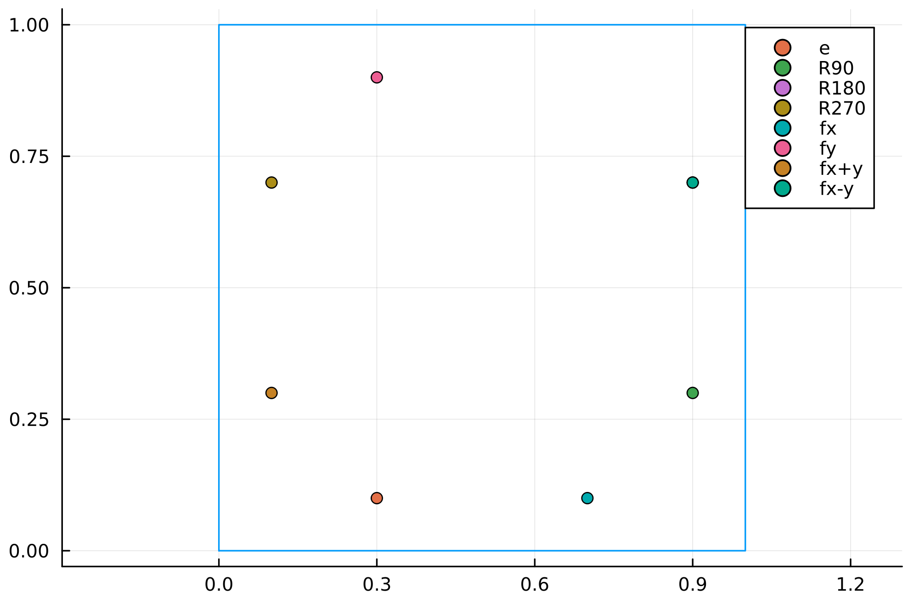

$T(R_{90}) = (1-y, x)$, therefore $\phi_{nm} = \sin(n \pi x)\sin(n \pi y) \to \phi_{nm}(1-y,x) = -\sin(n\pi y) \sin(n \pi x)$.  Because of the characteristics of sine, a rotation by 90 looks the same as a negation 

The concept of a representation here is the same as in the case of operators.  A representation is a mapping that takes you from an abstract idea like rotation by 90, to the actual concrete thing that does the rotation, like a matrix, or in our case it was something like $(y, x)$, which can be thought of as the matrix $\begin{pmatrix} 0 & 1 \\ 1 & 0\end{pmatrix}$.  The key thing that is maybe new here is that the representation is acting on the inputs to the function.  In other words, $G$ acts on the parameters of $W$

In what sense does $T(g)$ live in $V$? and why is $V$ the carrier space of $T$?  I didn't understand this

If there is a new basis that is isomorphic to the old one, and we know the mapping, $f$, then we also know the mapping between the old representation and the new representation of $G$ on the new basis $T' = f \circ T \circ f^{-1}$

Do we think of teh $G$ acting on the parameters or the functions? $T(g)$ tells us how $G$ acts on the parameters or functions?

$T_g$ turns one of our basis functions into another one of our basis functions by modifying its arguments.  Just like how a group action turns an element in a set into another element in the same set.  That's literally what's happening here but the set in this group action is the arguments of the functions?

How did we know that the laplacian operator $W$ had this property of symmetries of the square and therefore we could allow $G$ to act on it?  And how can we know when to apply other groups to other differential equations/ operators?

## 90

For the group $A_4$ and the set of all combinations of $4$ elements which are $0$ or $1$, and invariant subset under th left action of $A_4$ is 

$$\{(0,0,0,1), (0,0,1,0), (0,1,0,0), (1,0,0,0)\}$$

This is invariant because permutations of one element in the subset always gives you another element in the subset

The orbit of $\{(0,0,0,1)\}$ is $\{(0,0,0,1), (0,0,1,0), (0,1,0,0), (1,0,0,0)\}$

The orbit of $\{(1,1,1,1)\}$ is $\{(1,1,1,1)\}$

The orbit of $\{(0,0,1,1)\}$ is $\{(0,1,0,1), (1,0,0,1), (1,0,1,0), (1,1,0,0), (0,1,1,0), (0,0,1,1)\}$

The orbit of $\{(0,1,1,1)\}$ is $\{(0,1,1,1), (1,0,1,1), (1,1,0,1), (1,1,1,0)\}$

The largest orbit is order $6$ and the smallest is order $1$

The number of $1$s determines the unique orbit An equal ammount of $1$s and $0$s produces the largest orbit.  

The action of this group on the set is not transitive because you cannot reach the entire set from $(1,1,1,1)$.  It is effective but not free because some $g$s get stuck in some places, but no $g$ gets stuck everywhere 

The stabilizer for $(1,0,0,1)$ is $(1,4)$ and the stabilizer for $(0,1,0,1)$ is $(2,4)$

I feel like I can idetify invariant subsets for this simple problem where the group was a permutation group and the set contained only $0$s and $1$s but to find invariant subsets for a general group action on a general set seems hard.  Though I suppose it wasn't that hard for the rotations/reflections on a unit circle because that was a more geomatric example.

## 94

The operator $W = \frac{\partial^2 }{\partial x^2} + \frac{\partial^2}{\partial y^2}$ has symmetries of the square because when you perform all of the actions of the group $W$ remains unchanged ($x \to y, x \to -x$, etc.)

The eigenfunctions of $W$ are not invariant under the full group, but only some elements in the group.  Some eigenfunctions tranform into one another under the action of the full group. 

$\phi_{12}(x,y) = \sin(\pi x)\sin(2\pi y)$ transforms into $\phi_{21}(x,y) = \sin(2\pi x)\sin(\pi y)$ under some elements of the group.  This is because they are eigenfunctions of $W$ with the same eigenvalue.  They are members of the same invariant subspace.

The matrix representation of each symmetry is

$$\begin{array}{c|c} g & T(g)  \\
\hline
e & \begin{pmatrix} 1 & 0 \\ 0 & 1 \end{pmatrix}  \\
R_{90} & \begin{pmatrix} 0 & -1 \\ 1 & 0 \end{pmatrix}   \\
R_{180}  & \begin{pmatrix} 0 & -1 \\ -1 & 0 \end{pmatrix} \\
R_{270} & \begin{pmatrix} 0 & 1 \\ -1 & 0 \end{pmatrix} \\
f_x & \begin{pmatrix} -1 & 0 \\ 0 & 1 \end{pmatrix} \\
f_y & \begin{pmatrix} 1 & 0 \\ 0 & -1 \end{pmatrix} \\
f_{x+y} & \begin{pmatrix} 0 & 1 \\ 1 & 0 \end{pmatrix} \\
f_{y-x} & \begin{pmatrix} 0 & -1 \\ -1 & 0 \end{pmatrix} \\

 \end{array}$$

This is a faithful representation because each element has a unique matrix 

Every matrix representation is either $0$, $1$, or $-1$.  This is because the symmetries just do a combination of rearranging, and negating the $x$ and $y$ coordinates

if $V = \{\phi_{11}, \phi_{12}, \phi_{21}, \phi_{22}\}$ then the invariant subspaces are $\{\phi_{11}\}$, $\{\phi_{12}, \phi_{21}\}$, and $\{\phi_{22}\}$ this means that the representation is reducible, and there are $3$ irreducible representations present in my representation?  I'm still a little confused about why we say that the representation is reducible rather than the suspace being reducible by $T$.  It doesn't seem lik $T$ is being reduced because every time we use all of $T$ to determine if a subspace is invariant

