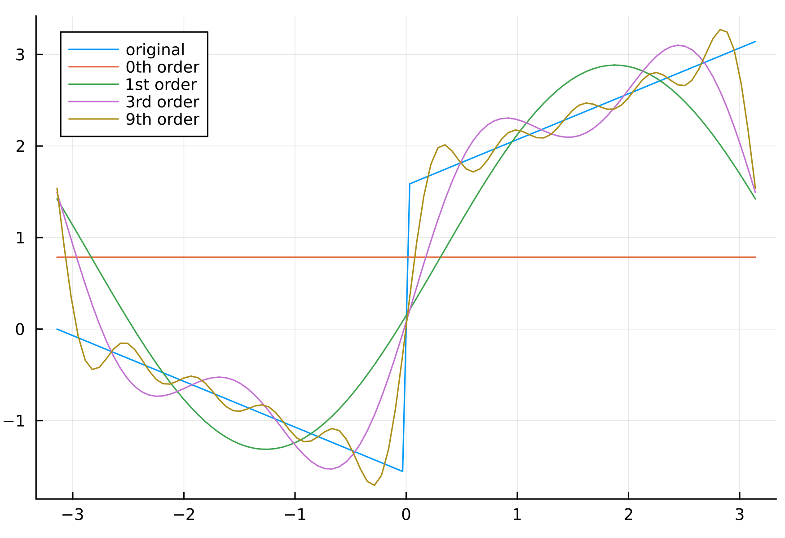
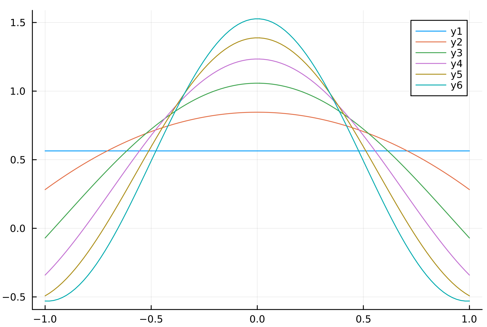
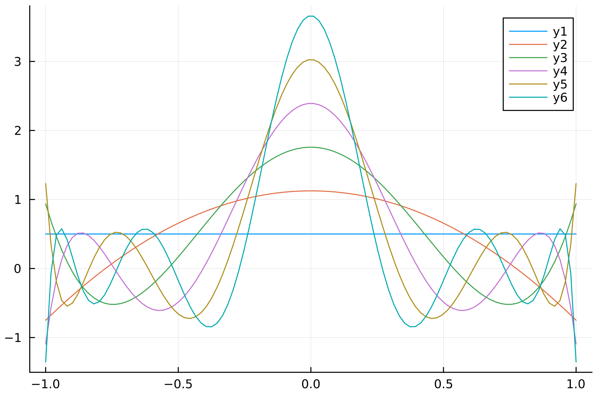

## 1

a) Construct a vector space using a scalar field of your choice and the set of $2 \times 2$ matrices with complex entries.  Show that all the properties of a vector space hold under your construction

Let $V = \mathbb{C}^{2 \times 2}$

First we must define vector addition

$$A + B = \begin{pmatrix}

a_{11} + b_{11} & a_{12} + b_{12} \\

a_{21} + b_{21} & a_{22} + b_{22}

\end{pmatrix}$$

where $a_{ij}$ and $b_{ij}$ are the $ijth$ element of $A$ and $B$ respectively, and $A,B \in V$.  Here $a_{ij} + b_{ij}$ represents the normal sum of two complex numbers in $\mathbb{C}$.  Wince $\mathbb{C}$ already satisfies the requirements of a vector space, I will not elaborate on addition and multiplication for complex scalars, but focus on the $2 \times 2$ matrix of complex scalars

$$A + B = a_{ij} + b_{ij} = b_{ij} + a_{ij} = B + A$$

$$A + (B + C) = a_{ij} + (b_{ij} + c_{ij}) = (a_{ij} + b_{ij}) + c_{ij} = (A + B) + C$$

The zero vector in $V$ is a $2 \times 2$ matrix full of complex zeros (zero real and zero imaginary) defined as $0 = 0_{ij}$

$$A + 0 = a_{ij} + 0_{ij} = a_{ij} = A$$

The negative of a vector $A \in V$ is defined as $-A = -a_{ij}$.  $-a_{ij}$ consists of the negative of the real part of $a_{ij}$ and the negative of the imaginary part of $a_{ij}$

$$A + -A = a_{ij} + -a_{ij} = 0_{ij} = 0$$

Scalar multiplication is defined as $\alpha A = \alpha a_{ij}$ where $\alpha a_{ij}$ for the complex scalar is $\alpha$ time the real and imaginary part of $a_{ij}$

$$\alpha (\beta A) = \alpha (\beta a_{ij}) = \alpha \beta a_{ij} = \alpha \beta A$$

$$1 A = 1 a_{ij} = a_{ij} = A$$

$$\alpha(A + B) = \alpha (a_{ij} + b_{ij}) = \alpha a_{ij} + \alpha b_{ij}$$

$$(\alpha + \beta)A = (\alpha + \beta)a_{ij} = \alpha a_{ij} + \beta a_{ij} = \alpha A + \beta A$$

Therefore all off the requirements are satisfied and $V$ is a vector space

b) Is it possible to define an inner product and extend this vector space to an inner product space?  If not, demonstrate why not.  If it is possible, give an example of an inner product and show that the necessary properties hold.

It is possible to define an inner product. 

$$\langle A, B \rangle = \sum_{ij}a_{ij} b_{ij}$$

This is an inner product because

$$\langle A, B \rangle =  \sum_{ij}a_{ij} b_{ij} =  \sum_{ij}b_{ij} a_{ij} = \langle B, A \rangle$$

$$\langle A, \beta B + \gamma C \rangle =  \sum_{ij}a_{ij} (\beta b_{ij} + \gamma c_{ij}) =  \sum_{ij}a_{ij} \beta b_{ij} + a_{ij} \gamma c_{ij} =  \beta \langle A, B\rangle + \gamma \langle A, C\rangle $$

$$\langle A, A \rangle = \sum_{ij}a_{ij}^2 \ge 0$$

## 2

Find a bijection $f : \mathbb{N} \to \mathbb{Z}$ where $\mathbb{N}$ are the natural (non-negative integer) numbers and $\mathbb{Z}$ is the set of all integers.  How do you know that your mapping is not a surjection or injection, but a bijection?

The map

$$f(n) = \begin{cases}
\frac{n+1}{2} & \text{if n is odd} \\
\frac{-n}{2} & \text{if n is even}
\end{cases}$$

Is injective because one output was produced by only one input.  If the output s negative the input was even, and the absolute value of the negative integer determines which even natural number was input, and the same is true for the positive integers.

It is also surjective because every integer is hit once. As the natural numbers go to infinity, the outputs are sequentially positive then negative then positive then negative, and the absolute values of the integers keeps incrementing to infinity.

## 3

Consider the space of real polynomials of degree 2 or less $P_2^r[t]$, starting with the set $\{ 1, t, t^2\}$ and the inner product

$$\langle g, f \rangle = \int_{-1}^1 g(t) f(t) w(t) dt $$

a) Use the Grahm-Schmidt process to find an orthonormal basis for this vector space

$$e_0 = \frac{a_0}{\sqrt{\langle a_0, a_0 \rangle}} = \frac{1}{\sqrt{2}}$$

$$e_1' = a_1 - e_0 \langle e_0, a_1 \rangle = t - \frac{1}{2} \int_{-1}^1 t dt = t$$

$$e_1 = \frac{e_1'}{\sqrt{\langle e_1', e_1' \rangle}} = \sqrt{\frac{3}{2}}t$$

$$e_2' = a_2 - e_1 \langle e_1, a_2 \rangle - e_0 \langle e_0, a_2 \rangle = t^2 - \frac{3}{2}t \int_{-1}^1 t^3 dt - \frac{1}{2} \int_{-1}^1 t^2 dt = t^2 - \frac{1}{3}$$

$$e_2 = \frac{e_2'}{\sqrt{\langle e_2', e_2' \rangle}} = \frac{t^2 - \frac{1}{3}}{\sqrt{\int_{-1}^{1}(t^4 - \frac{2t^2}{3} + \frac{1}{9})dt}} = \sqrt{\frac{45}{8}}(t^2 - \frac{1}{3}) $$

b) Express $h(t) = 3 t^2 - 1$ in this basis
 
$$h(t) = c_0e_0 + c_1e_1 + c_2e_2$$

Where

$$c_0 = \langle e_0, h \rangle = 0$$ 
$$c_1 = \langle e_1, h \rangle = 0$$

$$c_2 = \langle e_2, h \rangle = \sqrt{\frac{45}{8}}\int_{-1}^1(3t^4 - 2t^2 + 1/3) = \sqrt{\frac{45}{8}}\frac{8}{15}$$

The coefficients are projections of the funciton $h$ onto each basis function.  $h$ expressed in this basis is $(0,0,\sqrt{\frac{45}{8}}\frac{8}{15})$

## 4

The mapping $\xi(|a \rang) = \lang a | a \rang$ is not generally linear.

If we define $a$ as

$$a = \begin{pmatrix}
a_1 \\
a_2 \\
\vdots \\
a_n
\end{pmatrix}$$

And the inner product $\lang a|b \rang$ as the normal sum of the products of the vector elements, then

$$\lang a | a \rang = \sum_{i=1}^n a_i^2$$

This inner product is clearly not linear with respect to $a$ because

$$\xi(\alpha a + \beta b) = \lang\alpha a + \beta b | \alpha a + \beta b\rang = \sum_{i=1}^n (\alpha a_i + \beta b_i)^2 = \sum_{i=1}^n \alpha^2a_i^2 + 2\alpha \beta a_ib_i + \beta^2 b_i^2$$

$$\alpha\xi(a) + \beta\xi(b) = \alpha\sum_{i=1}^n a_i^2 + \beta\sum_{i=1}^n b_i^2$$

The two expressions are not equal, and the mapping is not linear. 

## 5

$W$ is a subspace of $\R^5$ defined by 

$$W = \{(x_1, \cdots, x_5) | x_1 = 3x_2 + x_3, x_2 = x_5, \text{and} x_4 = 2x_3\}$$

A basis for $W$ is

$$B = \{ 
\begin{pmatrix}  
1 \\
0 \\
1 \\
2 \\
0
\end{pmatrix}, 

\begin{pmatrix}
0 \\
1 \\
-3 \\
-6 \\
1
\end{pmatrix}\}$$

## 6

With the underlying vector space $\R^3$, and the equivalence relation $a \bowtie b$ if $\lang a, a \rang = \lang b, b \rang$, a factor set is the set of all equivalence classes defined by this equivalence relation.

This factor set creates a factor space where each vector $a$ is labeled by it's norm $\lang a,a \rang$.  

The dimension of the original vector space is 3, the dimension of the equivalence classes the make up the factor set is 2.  The dimension of the factor set itself is 1

In this case, the equivalence classes are spherical surfaces.  Each equivalence classes has a different radius

A factor space is constructed from the factor set by defining vectors that are labeled with the radius of that equivalence class

In order to know if the set of radii is a vector space, we need to know if its possible to make linear combinations of them and still obtain another "radius" or vector in the factor space.  We can do this by defining vector addition in this space as the scalar multiplication of the radii

$$|a \rang + |b \rang = ab$$

And we define scalar multiplication to be exponentiation 

$$a\lpha a = a^{\alpha}$$

This is logarithmic space, and as shown in a previous assignment it adheres to all the necessary properties of a vector space

We defined addition and multiplication in this way in order to avoid the problem of "negative" radii that would arrise if we defined addition in the normal way.

This factor space is isomorphic to $\R^+$, the space of one dimensional positive real numbers

## 7

using the vector space of all two dimensional vectors $v = (a,b)$ where $a,b \in \R$, vector multiplication is defined as

$$v_1 \cdot v_2 = (sum(v_1)a_2, sum(v_1) b_2)$$

So it scales the second vector by the sum of the elements of the first vector.

This definition of vector vector products is valid because

$$v_1 \cdot (\beta v_2 + \gamma v_3) = ((a_1 + b_1)(\beta a_2 + \gamma a_3), (a_1 + b_1) (\beta b_2 + \gamma b_3)) $$
$$ = (\beta (a_1 + b_1)a_2 + \gamma (a_1 + b_1) a_3, \beta (a_1 + b_1) b_2 + \gamma (a_1 + b_1)b_3) = \beta v_1 \cdot v_2 + \gamma v_1 \cdot v_3$$

And

$$(\beta v_2 + \gamma v_3) \cdot v_1 = (\beta (a_2+b_2)a_1 + \gamma (a_3+b_3) a_1,\beta (a_2+b_2)b_1 + \gamma (a_3+b_3) b_1) = \beta v_2 \cdot v_1 + \gamma v_3 \cdot v_1$$

This algebra is associative because

$$v_1 \cdot (v_2 \cdot v_3) = (a_1 + b_1)(a_2 + b_2) v_3 = (v_1 \cdot v_2) \cdot v_3$$

It is not communitive because $v_1 \cdot v_2 \ne v_2 \cdot v_1$.  This is obvious since the result is a scaled version of the second argument, so order matters.

The algebra does not have an identity element because the right multiplication fails for arbitrary $v$

$$v \cdot 1 = (a + b)1 \ne v$$

Because it is not unitary, the algebra is also not central.

The center of the algebra is the vector $(0,0)$ because it is the only one that commutes with all other elements by resulting in $(0,0)$ for all $v$

## 8

The mapping defined by the matrix

$\begin{pmatrix} 1 & 0 & 0 \\
                 0 & 1 & 0 \\
                 0 & 0 & 0\end{pmatrix}$

has the non-trivial null space $Span\{(0, 0, 1)\}$

The geomatric interpretation of the null space is the z-axis.  Any vector that lies on the z-axis will be mapped to $0$

A map is linear if it satisfies the requirement

$$T(\alpha a + \beta b) = \alpha Ta = \beta Tb$$

for any arbitrary $a$ and $b$

This means that the image of the linear combination of two input vectors, is the linear combination of those two input's images

## 9

The set of of monomials $\{1, t, t^2\}$ can be made into a vector space by defining vector addition as the normal addition of monomials.  

A vector in this space would look like a polynomial of order 2 or below

$x = x_11 + y_2t + z_3t^2$

Then vector addition holds all the necessary properties

$$x + y = x_1 + y_1 + (x_2 +y_2)t + (x_3 + y_3)t^2 = y + x$$

$$x + (y + z) = x_1 + y_1 + z_1 + (x_2 + y_2 + z_2)t + (x_3 + y_3 + z_3)t^2 = (x + y) + z$$

$$x + 0 = x_1 + x_2t + x_3t^2 = x$$

$$x + -x = x_1 - x_1 + (x_2 - x_2)t + (x_3 - x_3)t^2 = 0$$

And so does scalar multiplication

$$a(bx) = abx_1 + abx_2t + abx_3t^2 = (ab)x$$

$$1x = 1x_1 + 1x_2t + 1x_3t^2 = x$$

$$a(x + y) = (ax_1 + ay_1) + (ax_2 + ay_2)t + (ax_3 + ay_3)t^2 = ax + ay$$

$$(a+b)x = (ax_1 + bx_1) + (ax_2 + bx_2)t + (ax_3 + bx_3)t^2 = ax + bx$$

A subspace of this vector space is $\{1, t\}$.  This obeys all the same rules as the original, with vector addition working the same way, but without any $t^2$ terms 

To turn this into an inner product space, we can define the inner product as

$$\lang x | y \rang = \int_{- \infty}^{\infty} x(t)y(t) dt$$

where $x(t)$ and $y(t)$ are the polynomials defined by the vectors $x$ amd $y$ respectively.

## 10

$\R^3$ is isomorphic to $\mathbb{P}^2[t]$ because there is a bijective map between them.  A vector in $\mathbb{P}^2[t]$ takes the form

$$c_0 + c_1t + c_2t^2$$

The vector that maps to this from $\R^3$ takes the form

$$\begin{pmatrix}
c_0 \\ c_1 \\ c_2
\end{pmatrix}$$

This mapping is injective and surjective because every point in the codomain is it exaclty once.  In oterh words, if I have a polynomial, I know exactly the vector in $\R^3$ that mapped to it, and there is no polynomial of that form that cannot be reached by a vector in $\R^3$.  This is obvious from the definition of the mapping

$$P(c_0, c_1, c_2) : \R^3 \to \mathbb{P}^2[t] = c_0 + c_1t + c_2t^2$$

## 12

Let $a_1 = (1,1,-1)$, and $a_2 = (-2, 1, -1)$

The projection operator $P_1$ that projects onto $a_1$ is 

$$P_1 = \frac{a_1 a_1^T}{a_1^T a_1} = \frac{1}{3}\begin{pmatrix} 1 & 1 & -1 \\ 1 & 1 & -1 \\ -1 & -1 & 1\end{pmatrix}$$

This is a projection operator because hermitian by inspection, and because

$$P_1^2 = \frac{1}{9}\begin{pmatrix} 1 & 1 & -1 \\ 1 & 1 & -1 \\ -1 & -1 & 1\end{pmatrix}\begin{pmatrix} 1 & 1 & -1 \\ 1 & 1 & -1 \\ -1 & -1 & 1\end{pmatrix} = \frac{1}{3}\begin{pmatrix} 1 & 1 & -1 \\ 1 & 1 & -1 \\ -1 & -1 & 1\end{pmatrix} = P_1$$

Repeating the same for $a_2$,

$$P_2 = \frac{a_2 a_2^T}{a_2^T a_2} = \frac{1}{6}\begin{pmatrix} 4 & -2 & 2 \\ -2 & 1 & -1 \\ 2 & -1 & 1\end{pmatrix}$$

$$P_2^2 = \frac{1}{36}\begin{pmatrix} 4 & -2 & 2 \\ -2 & 1 & -1 \\ 2 & -1 & 1\end{pmatrix}\begin{pmatrix} 4 & -2 & 2 \\ -2 & 1 & -1 \\ 2 & -1 & 1\end{pmatrix} = \frac{1}{6}\begin{pmatrix} 4 & -2 & 2 \\ -2 & 1 & -1 \\ 2 & -1 & 1\end{pmatrix} = P_1$$

The operator $P = P_1 + P_2 = \frac{1}{2} \begin{pmatrix} 2 & 0 & 0 \\ 0 & 1 & -1 \\ 0 & -1 & 1\end{pmatrix}$

Which is symmetric, and 

$$P^2 = \frac{1}{4}\begin{pmatrix} 4 & 0 & 0 \\ 0 & 2 & -2 \\ 0 & -2 & 2\end{pmatrix} = P$$

The opertator $P$ acting on an arbitrary vector is 

$$Pv = \frac{1}{2} \begin{pmatrix} 2 & 0 & 0 \\ 0 & 1 & -1 \\ 0 & -1 & 1\end{pmatrix} \begin{pmatrix} x \\ y \\ z\end{pmatrix} = \begin{pmatrix} x \\ \frac{y - z}{2} \\ \frac{z - y}{2}\end{pmatrix}$$

The cross product 

$$a_1 \times a_2 = \begin{pmatrix} 0 \\ 3 \\ 3 \end{pmatrix}$$

Then

$$(a_1 \times a_2) \cdot Pv = \frac{3}{2}(y - z) + \frac{3}{2} (z - y) = 0$$

This is expected because $a_1 \times a_2$ is a vector that is perpendicular to $a_1$ and $a_2$, and $Pv$ is the projection of $v$ onto $a_1$ and $a_2$, which has components only in the direction of $a_1$ and $a_2$

## 13

The vectors $a_1 = (1,1,1)$, $a_2 = (-3, -1, 1)$ and $a_3 = (3, -1, 1)$ form a spanning set of $\R^3$ because they are linearly independant by inspection.  You cannot form $a_1$ from linear combinations of $a_2$ and $a_3$ and the same goes for the other cases 

Using the Graham-Schmidt process,

$$e_1 = \frac{a_1}{\sqrt{\lang a_1, a_1 \rang}} = \begin{pmatrix} 0.577 \\ 0.577 \\ 0.577 \end{pmatrix}$$

$$e_2' = a_2 - e_1\lang e_1 a_2 \rang = \begin{pmatrix} -2 \\ 0 \\ 2 \end{pmatrix}$$

$$e_2 = \frac{e_2'}{\sqrt{\lang e_2', e_2' \rang}} = \begin{pmatrix} -0.707 \\ 0 \\ 0.707 \end{pmatrix}$$

$$e_3' = a_3 - e_1\lang e_1 a_3 \rang - e_2 \lang e_2 a_3 \rang = \begin{pmatrix} 1 \\ -2 \\ 1 \end{pmatrix}$$

$$e_3 = \frac{e_3'}{\sqrt{\lang e_3', e_3' \rang}} = \begin{pmatrix} 0.408 \\ -0.816 \\ 0.408 \end{pmatrix}$$

The tranformation that maps the standard basis to this new basis is

$$T = \begin{pmatrix} 0.577 & -0.707 & 0.408 \\ 0.577 & 0 & -0.816 \\ 0.577 & 0.707 & 0.408 \end{pmatrix}$$

The following vectors $b_1 = (2,2,2)$, $b_2 = (1-\sqrt{3}, -2, \sqrt{3} + 1)$, and $b_3 = (1,0,0)$ transformed into the new basis are

$$Tb_1 = \begin{pmatrix} 0.557 \\ -0.478 \\ 3.385 \end{pmatrix}$$
$$Tb_2 = \begin{pmatrix} 2.107 \\ -2.653 \\ -0.722 \end{pmatrix}$$
$$Tb_3 = \begin{pmatrix}0.577  \\ 0.577  \\ 0.577 \end{pmatrix}$$

## 14

The operator $T$ is represented as the matrix $T = \begin{pmatrix} 0 & -1 \\ -1 & 0 \end{pmatrix}$

This operator is Hermitian because

$$T^{\dag} = T$$

And symmetric because the off-diagonal elements are equal.

Since it is Hermitian, it is also normal

$$T^{\dag}T = T^2 = TT^{\dag}$$

It is unitary because

$$TT^{\dag} = \begin{pmatrix} 0 & -1 \\ -1 & 0 \end{pmatrix}\begin{pmatrix} 0 & -1 \\ -1 & 0 \end{pmatrix} = \begin{pmatrix} 1 & 0 \\ 0 & 1 \end{pmatrix} = I $$

It is not orthogonal because 

$$T^{\dag}T \ne 0$$

The spectral decomposition of this matrix is created by solving the eigenvalue problem

$$Tx = \lambda x$$

To solve for $\lambda$, we look at the charachteristic polynomial

$$det(T - \lambda I) = det\begin{pmatrix} -\lambda & -1 \\ -1 & -\lambda \end{pmatrix} = 0$$

Which yields

$$\lambda^2 - 1 = 0$$

And

$$\lambda = 1,-1$$

For $\lambda = 1$,

$$\begin{pmatrix} -1 & -1 \\ -1 & -1 \end{pmatrix} \begin{pmatrix} x \\ y \end{pmatrix} = \begin{pmatrix} 0 \\ 0 \end{pmatrix}$$

Which yields

$$x = -y$$

For $\lambda = -1$,

$$\begin{pmatrix} 1 & -1 \\ -1 & 1 \end{pmatrix} \begin{pmatrix} x \\ y \end{pmatrix} = \begin{pmatrix} 0 \\ 0 \end{pmatrix}$$

Which yields

$$x = y$$

Therefore, appropriate eigenvectors are $(\frac{1}{\sqrt{2}}, -\frac{1}{\sqrt{2}})$, and $(\frac{1}{\sqrt{2}}, \frac{1}{\sqrt{2}})$

Using the results for the spectral decomposition, we have

$$T = \begin{pmatrix} \frac{1}{\sqrt{2}} & \frac{1}{\sqrt{2}} \\ -\frac{1}{\sqrt{2}} & \frac{1}{\sqrt{2}}\end{pmatrix} \begin{pmatrix} 1 & 0 \\ 0 & -1 \end{pmatrix} \begin{pmatrix} \frac{1}{\sqrt{2}} & -\frac{1}{\sqrt{2}} \\ \frac{1}{\sqrt{2}} & \frac{1}{\sqrt{2}}\end{pmatrix}$$

The projection operator corresponding to the first eigenvector is 

$$P_1 = \begin{pmatrix} \frac{1}{\sqrt{2}} \\ -\frac{1}{\sqrt{2}}\end{pmatrix} \begin{pmatrix} \frac{1}{\sqrt{2}} & \frac{1}{\sqrt{2}}\end{pmatrix} = \frac{1}{2}\begin{pmatrix} 1 & -1 \\ -1 & 1\end{pmatrix}$$

And the projection operator corresponding to the second eigenvector is

$$P_1 = \begin{pmatrix} \frac{1}{\sqrt{2}} \\ \frac{1}{\sqrt{2}}\end{pmatrix} \begin{pmatrix} \frac{1}{\sqrt{2}} & \frac{1}{\sqrt{2}}\end{pmatrix} = \frac{1}{2}\begin{pmatrix} 1 & 1 \\ 1 & 1\end{pmatrix}$$

To verify $P_iP_j = 0$ for $i \ne j$

$$P_1P_2 = \frac{1}{4} \begin{pmatrix} 1 & -1 \\ -1 & 1 \end{pmatrix}\begin{pmatrix} 1 & 1 \\ 1 & 1\end{pmatrix} = \begin{pmatrix} 0 & 0 \\ 0 & 0 \end{pmatrix}$$
$$P_2P_1 = \frac{1}{4} \begin{pmatrix} 1 & 1 \\ 1 & 1 \end{pmatrix}\begin{pmatrix} 1 & -1 \\ -1 & 1\end{pmatrix} = \begin{pmatrix} 0 & 0 \\ 0 & 0 \end{pmatrix}$$

To verify $P_i^2 = P_i$

$$P_1P_1 = \frac{1}{4} \begin{pmatrix} 1 & -1 \\ -1 & 1 \end{pmatrix}\begin{pmatrix} 1 & -1 \\ -1 & 1\end{pmatrix} = \frac{1}{2}\begin{pmatrix} 1 & -1 \\ -1 & 1 \end{pmatrix} = P_1$$
$$P_2P_2 = \frac{1}{4} \begin{pmatrix} 1 & 1 \\ 1 & 1 \end{pmatrix}\begin{pmatrix} 1 & 1 \\ 1 & 1\end{pmatrix} = \frac{1}{2} \begin{pmatrix} 1 & 1 \\ 1 & 1 \end{pmatrix} = P_2$$

To verify $\sum_{k=1}^N P_k = I$

$$P_1 + P_2 = \frac{1}{2} \begin{pmatrix} 1 & -1 \\ -1 & 1 \end{pmatrix} + \frac{1}{2}\begin{pmatrix} 1 & 1 \\ 1 & 1\end{pmatrix} = \begin{pmatrix} 1 & 0 \\ 0 & 1 \end{pmatrix}$$

To verify $T = \sum_{k=1}^N \lambda_k P_k$

$$\lambda_1P_1 + \lambda_2 P_2 = \frac{1}{2} \begin{pmatrix} 1 & -1 \\ -1 & 1 \end{pmatrix} - \frac{1}{2}\begin{pmatrix} 1 & 1 \\ 1 & 1\end{pmatrix} = \begin{pmatrix} 0 & -1 \\ -1 & 0 \end{pmatrix} = T$$

## 16

The matrix

$$A = \begin{pmatrix} 4 & i & 1 \\ -i & 4 & -i \\ 1 & i & 4\end{pmatrix}$$

Has eigenvalues $(6,3,3)$ and eigenvectors

$$v_1 = \frac{1}{\sqrt{3}}\begin{pmatrix} 1 \\ -i \\ 1\end{pmatrix} \; v_2 =  \frac{1}{\sqrt{2}}\begin{pmatrix} -1 \\ 0 \\ 1\end{pmatrix} \; v_3 =  \frac{1}{\sqrt{6}}\begin{pmatrix} -i \\ 2 \\ -i\end{pmatrix}$$

The projection matrices are 

$$P_1 = \frac{|v_1\rang \lang v_1|}{\lang v_1 | v_1 \rang} = \frac{1}{3}\begin{pmatrix}1 & i & 1 \\ -i & 1 & -i \\ 1 & i & 1 \end{pmatrix}$$

$$P_2 = \frac{|v_2\rang \lang v_2|}{\lang v_2 | v_2 \rang} = \frac{1}{2}\begin{pmatrix}1 & 0 & -1 \\ 0 & 0 & 0 \\ -1 & 0 & 1 \end{pmatrix}$$

$$P_3 = \frac{|v_3\rang \lang v_3|}{\lang v_3 | v_3 \rang} = \frac{1}{6}\begin{pmatrix}1 & -2i & 1 \\ 2i & 4 & 2i \\ 1 & -2i & 1 \end{pmatrix}$$

These are complete,

$$P_1 + P2 + P3 = \begin{pmatrix} 1 & 0 & 0 \\ 0 & 1 & 0 \\ 0 & 0 & 1\end{pmatrix}$$

And

$$6P_1 + 3P_2 + 3P_3 = \begin{pmatrix} 4 & i & 1 \\ -i & 4 & -i \\ 1 & i & 4\end{pmatrix}$$

Using Taylor series expansions,

$$\sqrt{A} = \begin{pmatrix} 1.97 &  0.24i & 0.24 \\ -0.24i & 1.97 & -0.24i \\ 0.24 & 0.24i & 1.97\end{pmatrix}$$

$$\sin(\pi A/2) = 6 \begin{pmatrix} -4 & 2i & 2 \\ -2i & -4 & -2i \\ 2 & 2i & -4 \end{pmatrix}$$

$$\cos(\pi A/2) = 6 \begin{pmatrix} -2 & -2i & -2 \\ 2i & -2 & 2i \\ -2 & -2i & -2 \end{pmatrix}$$

$A$ is invertible because the eigenvectors are linearly independant.  $A^{-1}$ has the same eigenvectors $v_1, v_2, v_3$ as $A$, but the eigenvalues are inverted $(\frac{1}{6}, \frac{1}{3}, \frac{1}{3})$

## 17

To construct the fourier series of 

$$f(x) = \begin{cases} -\frac{1}{2}(\pi + x) & \text{if } -\pi \le x < 0 \\ \frac{1}{2}(\pi + x) & \text{if } 0 \le x < \pi\end{cases}$$

we find the first $5$ fourier coefficients

$$a_0 = \frac{1}{\pi} \int_{-\pi}^0 -\frac{1}{2}(\pi + x) dx + \frac{1}{\pi} \int_0^{\pi} \frac{1}{2}(\pi + x) dx = -\frac{\pi}{4} + \frac{3 \pi}{4} = \frac{\pi}{2}$$

$$a_1 = \frac{1}{\pi} \int_{-\pi}^0 -\frac{1}{2}(\pi + x) \cos x dx + \frac{1}{\pi} \int_0^{\pi} \frac{1}{2}(\pi + x) \cos x dx = -\frac{1}{\pi} - \frac{1}{\pi} = -\frac{2}{\pi}$$

$$b_1 = \frac{1}{\pi} \int_{-\pi}^0 -\frac{1}{2}(\pi + x) \sin x dx + \frac{1}{\pi} \int_0^{\pi} \frac{1}{2}(\pi + x) \sin x dx = \frac{1}{2} + \frac{3}{2} = 2$$

$$a_2 = \frac{1}{\pi} \int_{-\pi}^0 -\frac{1}{2}(\pi + x) \cos 2x dx + \frac{1}{\pi} \int_0^{\pi} \frac{1}{2}(\pi + x) \cos 2x dx = 0$$

$$b_2 = \frac{1}{\pi} \int_{-\pi}^0 -\frac{1}{2}(\pi + x) \sin 2x dx + \frac{1}{\pi} \int_0^{\pi} \frac{1}{2}(\pi + x) \sin 2x dx = \frac{1}{4} - \frac{1}{4} = 0$$

$$a_3 = \frac{1}{\pi} \int_{-\pi}^0 -\frac{1}{2}(\pi + x) \cos 3x dx + \frac{1}{\pi} \int_0^{\pi} \frac{1}{2}(\pi + x) \cos 3x dx = -\frac{1}{9 \pi} + -\frac{1}{9 \pi} = -\frac{2}{9 \pi}$$

$$b_3 = \frac{1}{\pi} \int_{-\pi}^0 -\frac{1}{2}(\pi + x) \sin 3x dx + \frac{1}{\pi} \int_0^{\pi} \frac{1}{2}(\pi + x) \sin 3x dx = \frac{1}{6} - \frac{1}{2} = \frac{2}{3}$$

$$a_5 = \frac{2}{\pi} \int_{-\pi}^0 -\frac{1}{2}(\pi + x) \cos 5x dx  = -\frac{2}{25 \pi}$$

$$b_5 = \frac{1}{\pi} \int_{-\pi}^0 -\frac{1}{2}(\pi + x) \sin 5x dx + \frac{1}{\pi} \int_0^{\pi} \frac{1}{2}(\pi + x) \sin 5x dx = \frac{1}{10} - \frac{3}{10} = \frac{2}{5}$$

$$a_{2n+1} = -\frac{2}{(2n+1)^2 \pi}$$

$$b_{2n+1} = \frac{2}{2n+1}$$

## 18

To find the polar decomposition of the matrix

$$A = \begin{pmatrix} -1 + i & -\sqrt{2} + \sqrt{2}i \\ -1 - i & \sqrt{2} + \sqrt{2}i \end{pmatrix}$$

we define

$$R^2 = A^{\dag} A = \begin{pmatrix} -1 - i  & -1 + i \\ -\sqrt{2} - \sqrt{2}i &  \sqrt{2} - \sqrt{2}i \end{pmatrix}\begin{pmatrix} -1 + i & -\sqrt{2} + \sqrt{2}i \\ -1 - i & \sqrt{2} + \sqrt{2}i \end{pmatrix} = \begin{pmatrix} 4 & 0 \\ 0 & 8 \end{pmatrix}$$

And then solve 

$$U = AR^{-1} = \begin{pmatrix} -1 + i & -\sqrt{2} + \sqrt{2}i \\ -1 - i & \sqrt{2} + \sqrt{2}i \end{pmatrix}\begin{pmatrix} \frac{1}{2} & 0 \\ 0 & \frac{1}{\sqrt{8}} \end{pmatrix} = \frac{1}{2}\begin{pmatrix} -1 + i & -1 +i \\ -1 - i & 1 + i\end{pmatrix}$$

And we have decomposed $A = UR$ 

## 19

$$a_1 = \frac{1}{\sqrt{2}} \begin{pmatrix} 1 \\ i\end{pmatrix}$$

$$a_2 = \frac{1}{\sqrt{2}} \begin{pmatrix} 1 \\ -i\end{pmatrix}$$

To change any vector $v = (a,b)$ into this basis, we project the vector onto $a_1$ and $a_2$

$$\lang a_1 | v \rang = \frac{1}{\sqrt{2}}\begin{pmatrix} 1 & -i\end{pmatrix} \begin{pmatrix} a \\ b \end{pmatrix} = \frac{1}{\sqrt{2}}(a - bi)$$

$$\lang a_2 | v \rang = \frac{1}{\sqrt{2}}\begin{pmatrix} 1 & i\end{pmatrix} \begin{pmatrix} a \\ b \end{pmatrix}= \frac{1}{\sqrt{2}}(a + bi)$$

The matrix that performs this operation is

$$\frac{1}{\sqrt{2}}\begin{pmatrix} 1 & -i \\ 1 & i\end{pmatrix}$$

Any matrix $A$ expressed in this basis is 

$$\frac{1}{2} \begin{pmatrix} 1 & 1 \\ i & -i\end{pmatrix}A\begin{pmatrix} 1 & -i \\ 1 & i\end{pmatrix}$$

## 20

To diagonalize 

$$A = \begin{pmatrix} 3 & i \\ -i & 3 \end{pmatrix}$$

We must find its eigenvectors

$$\det(A - \lambda I) = 8 - 6\lambda + \lambda^2 = (\lambda-4)(\lambda - 2) = 0$$

for $\lambda = 4$

$$\begin{pmatrix} -1 & i \\ -i & -1 \end{pmatrix} \begin{pmatrix} x_1 \\ x_2\end{pmatrix} = \begin{pmatrix} 0 \\ 0 \end{pmatrix}$$

So an eigenvector is $\frac{1}{\sqrt{2}}(1, -i)$ 

for $\lambda = 2$

$$\begin{pmatrix} 1 & i \\ -i & 1 \end{pmatrix} \begin{pmatrix} x_1 \\ x_2\end{pmatrix} = \begin{pmatrix} 0 \\ 0 \end{pmatrix}$$

$$x_2 = x_1i$$

So the other eigenvector is $\frac{1}{\sqrt{2}}(1, i)$ 

Therefore, the diagonlization is 

$$A = \frac{1}{2}\begin{pmatrix} 1 & 1 \\ -i & i\end{pmatrix}\begin{pmatrix}4 & 0 \\ 0 & 2 \end{pmatrix}\begin{pmatrix} 1 & i \\ 1 & -i\end{pmatrix}$$

## 21

To expand $\delta(x)$ in hermite polynomials,

$$a_0 = \frac{1}{\sqrt{\pi} 2^0 0!}\int_{-\infty}^{\infty} \delta(x) e^{-x^2}dx = \frac{1}{\sqrt{\pi}}$$

$$a_1 = \frac{1}{\sqrt{\pi} 2^1 1!}\int_{-\infty}^{\infty} \delta(x) 2x e^{-x^2}dx = 0$$

$$a_2 = \frac{1}{\sqrt{\pi} 2^2 2!}\int_{-\infty}^{\infty} \delta(x) (4x^2 - 2) e^{-x^2}dx = -\frac{1}{4 \sqrt{\pi}}$$

$$a_4 = \frac{1}{\sqrt{\pi} 2^4 4!}\int_{-\infty}^{\infty} \delta(x) (16x^4 - 48x^2 + 12) e^{-x^2}dx = \frac{1}{32 \sqrt{\pi}}$$

$$a_6 = -\frac{1}{384\sqrt{\pi}}$$

$$a_8 = \frac{1}{6144\sqrt{\pi}}$$

$$a_{10} = -\frac{1}{122880\sqrt{\pi}}$$

plotting this result

using legendre polynomials

$$a_0 = \frac{1}{2} \int_{-1}^1 \delta(x)dx = \frac{1}{2} $$

$$a_2 = \frac{5}{2} \int_{-1}^1 \delta(x) \frac{1}{2}(3x^2 - 1)dx = -\frac{5}{4} $$

$$a_4 = \frac{9}{2} \int_{-1}^1 \delta(x) \frac{1}{8}(35x^4 - 30x^2 + 3)dx = \frac{27}{16}$$

$$a_6 = -\frac{65}{32}$$

$$a_8 = \frac{595}{256}$$

$$a_{10} = -\frac{1323}{512}$$

## 22

The mapping $T(x_1,x_2,x_3) = (x_2 - ix_3, x_1 - ix_3, ix_1 + ix_2)$

is expressed as the matrix

$$T = \begin{pmatrix} 0 & 1 & -i \\ 1 & 0 & -i \\ i & i & 0 \end{pmatrix}$$

eignevalues are determined by the characteristic equations

$$\det \begin{pmatrix} -\lambda & 1 & -i \\ 1 & -\lambda & -i \\ i & i & -\lambda \end{pmatrix} = 0$$

or equivalently

$$-\lambda(\lambda^2 - 1) + 2(1 + \lambda) = 0$$

by plotting and examination the roots are $\lambda = -1, -1, 2$

$\lambda = -1$ results in the system

$$\begin{pmatrix} 1 & 1 & -i \\ 1 & 1 & -i \\ i & i & 1\end{pmatrix}\begin{pmatrix} x_1 \\ x_2 \\ x_3\end{pmatrix} = 0$$

So eigenvectors are $(i-1, 1,1)^T$ and $(i,i,2)^T$

$\lambda = 2$ results in the system

$$\begin{pmatrix} -2 & 1 & -i \\ 1 & -2 & -i \\ i & i & -2\end{pmatrix}\begin{pmatrix} x_1 \\ x_2 \\ x_3\end{pmatrix} = 0$$

So an eigenvector is $(i,i,1)^T$

## 23

for the matrix

$$T = \begin{pmatrix} 0 & 1 & -i \\ 1 & 0 & -i \\ i & i & 0 \end{pmatrix}$$

$$\lambda_1 + \lambda_2 + \lambda_3 = tr(T) = 0$$

and 

$$\lambda_1 \lambda_2 \lambda_3 = \det(T) = 0 + -ii + -ii = 2$$

with eigenvalues of $2, -1, -1$ and eigenvectors of

$$\frac{1}{\sqrt{3}} \begin{pmatrix} -i \\ -i \\ 1\end{pmatrix}, \; \frac{1}{\sqrt{2}} \begin{pmatrix} i \\ 0 \\ 1\end{pmatrix}, \; \frac{1}{\sqrt{2}} \begin{pmatrix} -1 \\ 1 \\ 0\end{pmatrix}$$

the projection operators of the eigenspaces are

$$P_1 = e_1e_1^{\dag} = \frac{1}{3} \begin{pmatrix}1 & 1 & -i \\ 1 & 1 & -i \\ i & i & 1 \end{pmatrix}$$

$$P_2 = e_2e_2^{\dag} = \frac{1}{2} \begin{pmatrix}1 & 0 & i \\ 0 & 0 & 0 \\ -i & 0 & 1 \end{pmatrix}$$

$$P_3 = e_3e_3^{\dag} = \frac{1}{2} \begin{pmatrix}1 & -1 & 0 \\ -1 & 1 & 0 \\ 0 & 0 & 0 \end{pmatrix}$$

with these projection operators

$$T = 2P_1 - P_2 - P_3$$

we construct $e^{i \pi T}$ through the taylor series

$$\sum_{k=0}^{\infty} (i \pi)^k \frac{T^k}{k!}$$

with 20 terms we can see the series is converging to

.png)

$$\frac{1}{3}\begin{pmatrix} -1 & 2 & -2i \\ 2 & -1 & -2i \\ 2i & 2i & -1 \end{pmatrix}$$

## 25

Normal: $AA^{\dag} = A^{\dag}A$ 

Symmetric: $A^T = A$

Anti-Hermitian: $A^{\dag} = -A$

Orthogonal: $A^TA = I$

Hermitian: $A^{\dag} = A$

Unitary: $A^{\dag}A = I$

Anti-Symmetric: $A^T = -A$

$$
\begin{array}{c|cccccc}
 & Symmetric & Ani-Hermitian & Orthogonal & Hermitian & Unitary & Anti-symmetric \\
\hline
Normal & Symmetric & Anti-Hermitian & Orthogonal & Hermitian & Unitary & Anti-symmetric \\
Symmetric & & 0 & I & Symmetric & I & 0\\ 
Anti-Hermitian & & & 0 & 0 & 0 & Anti-symmetric \\ 
Orthogonal & & & & I & Orthogonal & 0\\
Hermitian & & & & & I & 0\\
Unitary & & & & & & 0

\end{array}
$$

## 27

The operator

$$A = \begin{pmatrix} 1 + i & 1 + i \\ -1 - i & 1 + i\end{pmatrix}$$

Is normal because 

$$AA^{\dag} = \begin{pmatrix} 1 + i & 1 + i \\ -1 - i & 1 + i\end{pmatrix}\begin{pmatrix} 1 - i & -1 + i \\ 1 - i & 1 - i\end{pmatrix} = \begin{pmatrix} 4 & 0 \\ 0 & 4\end{pmatrix} = \begin{pmatrix} 1 - i & -1 + i \\ 1 - i & 1 - i\end{pmatrix}\begin{pmatrix} 1 + i & 1 + i \\ -1 - i & 1 + i\end{pmatrix} = A^{\dag}A$$

$\lambda_1 = 2i$ is a valid eigenvalue with eigenvector $v_1 = (-i, 1)$ because

$$Av_1 = \begin{pmatrix} 1 + i & 1 + i \\ -1 - i & 1 + i\end{pmatrix}\begin{pmatrix} -i \\ 1 \end{pmatrix} = \begin{pmatrix} 2 \\ 2i \end{pmatrix} = 2i \begin{pmatrix} -i \\ 1\end{pmatrix}$$

$\lambda_2 = 2$ is a valid eigenvalue with eigenvector $v_2 = (i, 1)$ because

$$Av_2 = \begin{pmatrix} 1 + i & 1 + i \\ -1 - i & 1 + i\end{pmatrix}\begin{pmatrix} i \\ 1 \end{pmatrix} = \begin{pmatrix} 2i \\ 2\end{pmatrix} = 2 \begin{pmatrix} i \\ 1\end{pmatrix}$$

Using thes eigenvectors, the projection matrices are

$$P_1 = \frac{v_1v_1'}{v_1'v_1} = \frac{1}{2}\begin{pmatrix}1 & -i \\ i & 1 \end{pmatrix}$$

$$P_2 = \frac{v_2v_2'}{v_2'v_2} = \frac{1}{2}\begin{pmatrix}1 & i \\ -i & 1 \end{pmatrix}$$

$$P_1 + P_2 = \frac{1}{2}\begin{pmatrix} 2 & 0 \\ 0 & 2\end{pmatrix} = I$$

$$A = \lambda_1P_1 + \lambda_2P_2 = i\begin{pmatrix}1 & -i \\ i & 1 \end{pmatrix} + \begin{pmatrix}1 & i \\ -i & 1 \end{pmatrix} = \begin{pmatrix}1+i & 1+i \\ -1 -i & 1+i \end{pmatrix}$$

Unitary matrix that diagonalizes $A$ is 

$$X = \frac{1}{2}\begin{pmatrix}-i & i \\ 1 & 1 \end{pmatrix}$$

$$A = X D X^{-1} = \frac{1}{2}\begin{pmatrix}-i & i \\ 1 & 1 \end{pmatrix}\begin{pmatrix} 2i & 0 \\ 0 & 2\end{pmatrix}\begin{pmatrix}i & 1 \\ -i & 1 \end{pmatrix}$$

$$\sqrt{A} = \frac{1}{2}\begin{pmatrix}-i & i \\ 1 & 1 \end{pmatrix}\begin{pmatrix} \sqrt{2i} & 0 \\ 0 & \sqrt{2}\end{pmatrix}\begin{pmatrix}i & 1 \\ -i & 1 \end{pmatrix} = \frac{1}{2}\begin{pmatrix}1-i & \sqrt{2}i \\ 1+i & \sqrt{2} \end{pmatrix}\begin{pmatrix}i & 1 \\ -i & 1 \end{pmatrix} $$
$$= \frac{1}{2}\begin{pmatrix}1+\sqrt{2} +i & 1-(1-\sqrt{2})i \\ -1 + (1-\sqrt{2})i & 1+\sqrt{2}+i \end{pmatrix} $$

For the polar decomposition of $A$ 

$$R = \sqrt{A^{\dag}A} = \begin{pmatrix}2 & 0 \\ 0 & 2 \end{pmatrix}$$

$$U = AR^{-1} = \frac{1}{2}A = \frac{1}{2}\begin{pmatrix} 1 + i & 1 + i \\ -1 - i & 1 + i\end{pmatrix}$$

then we can write

$$A = UR$$

## 29

The matrices $m_1 = \begin{pmatrix} 0 & 1 \\ -1 & -1 \end{pmatrix}$ and $m_2 = \begin{pmatrix} 1 & 0 \\ -1 & -1 \end{pmatrix}$ form the following group

$$
\begin{array}{c|cccccc}
 & e & m_1 & m_1^2 & m_2 & m_1^2m_2 & m_2m_1^2 \\
\hline
e          & e        & m_1         & m_1^2       & m_2        & m_1^2m_2    & m_2m_1^2 \\
m_1        & m_1      & m_1^2       & e           & m_2m_1^2   & m_2         & m_1^2m_2 \\
m_1^2      & m_1^2    & e           & m_1         & m_1^2m_2   & m_2m_1^2    & m_2      \\
m_2        & m_2      & m_1^2m_2    & m_2m_1^2    & e          & m_1         & m_1^2    \\
m_1^2m_2   & m_1^2m_2 & m_2m_1^2    & m_2         & m_1^2      & e           & m_1      \\
m_2m_1^2   & m_2m_1^2 & m_2         & m_1^2m_2    & m_1        & m_1^2       & e
\end{array}
$$

The order of the group is $6$ and the identity element s the normal identity matrix $e = \begin{pmatrix} 1 & 0 \\ 0 & 1\end{pmatrix}$

As shown in the Cayley table, the inverse of $m_1$ is $m_1^2$ and the inverse of $m_2$ is $m_2$

The group $G_{\Delta}$ is isomorphic to our group.  We can think of $m_1$ as $R$, and $m_2$ as $A$, and we get the exact same Cayley table for both groups.

The isomorphism is

$$
\begin{array}{c|c}
M & G_{\Delta} \\ 
\hline
e & e \\
m_1 & R \\
m_1^2 & L \\
m_2 & A \\
m_1^2m_2 & B \\
m_2m_1^2 & C
\end{array}$$

